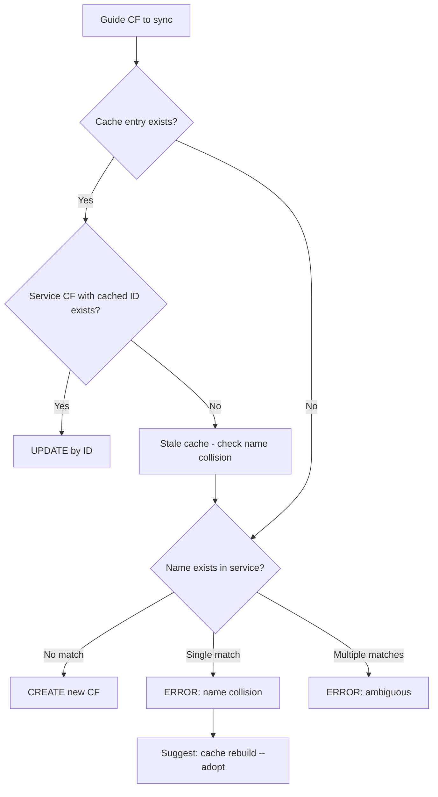

# Custom Format Matching and Cache System

## Problem Space

Custom Format (CF) synchronization presents a deceptively complex challenge: matching CFs from TRaSH
Guides to existing CFs in Sonarr/Radarr. The difficulty stems from a mismatch between Recyclarr's
assumptions and actual service behavior.

**The Core Assumption Problem**: Recyclarr originally assumed that Sonarr and Radarr enforced
case-insensitive uniqueness for CF names. This assumption enabled a simple name-based matching
strategy: find by name, update in place.

**Reality**: Sonarr uses case-sensitive comparison (`f.Name == c` in C#) for uniqueness validation.
This means:

- "HULU", "Hulu", and "hulu" can all coexist as separate CFs
- Case-insensitive name matching returns an arbitrary match when variants exist
- Attempting to update the wrong CF triggers "Must be unique" API errors

**Ownership Tracking**: Beyond matching, Recyclarr must track which CFs it created versus those
manually created by users. This ownership information determines:

- Which CFs to update during sync
- Which CFs to delete when `delete_old_custom_formats` is enabled
- How to handle CFs that exist in the service but aren't in the user's config

## Cache System

The cache provides the ownership tracking layer that makes reliable CF synchronization possible.

### What the Cache Contains

The cache stores `trash_id → service_id` mappings for CFs that Recyclarr manages:

```txt
trash_id (from TRaSH Guides)  →  service_id (from Sonarr/Radarr API)
```

Each mapping represents a CF that Recyclarr either created or explicitly adopted.

### Cache Scope: Configured CFs Only

**Critical invariant**: The cache only contains entries for CFs that appear in the user's YAML
configuration. It does NOT contain:

- Manually-created CFs with no trash_id
- TRaSH Guide CFs that aren't in the user's config

This scope restriction is essential for the `delete_old_custom_formats` feature. When enabled, sync
deletes CFs that are:

1. In the cache (Recyclarr owns them)
2. NOT in the current config (user removed them)

If the cache contained all guide-matching CFs (not just configured ones), removing a CF from config
would delete it even if the user never intended to manage it.

### Cache Storage

Cache files are stored per-instance in the app data directory:

```txt
<app_data>/cache/<instance_name>/custom-formats.json
```

The cache is service-scoped because service IDs are only meaningful within a single Sonarr/Radarr
instance.

## Matching Algorithm (ID-First)

The sync transaction phase uses an ID-first matching strategy that trusts cached IDs over name
matching.

### Decision Flow



### The Four Cases

#### Case 1: Cached ID exists + service CF exists → UPDATE

The cache provides a known-good ID. Update the service CF regardless of whether its name matches the
guide CF name. This handles legitimate renames: if a user renamed a CF in Sonarr, Recyclarr updates
it back to the guide name.

#### Case 2: Cached ID exists + service CF deleted → check name collision

The cache references a CF that no longer exists in the service (user deleted it manually, or
migrated to a new instance). Fall through to name collision checking to determine if a new CF can be
created.

#### Case 3: No cache + name exists in service → ERROR

A CF with this name exists but Recyclarr doesn't own it. This could be:

- A manually-created CF the user wants Recyclarr to adopt
- A leftover from a previous Recyclarr installation
- A naming coincidence

Rather than silently adopting, Recyclarr errors with a suggestion to run `cache rebuild --adopt`.
This makes adoption explicit and auditable.

#### Case 4: No cache + no name match → CREATE

No ownership and no name conflict. Safe to create a new CF.

### Ambiguous Match Detection

When checking for name collisions, Recyclarr uses case-insensitive matching (to mirror how users
think about names) but counts all matches:

- 0 matches: no collision, safe to create
- 1 match: collision, error with suggestion to adopt
- 2+ matches: ambiguous, error asking user to resolve duplicates in service

The ambiguous case prevents Recyclarr from guessing which of multiple case-variant CFs the user
intended.

## Cache Rebuild Command

The `cache rebuild` command provides explicit cache reconstruction when the cache is missing,
corrupted, or needs correction.

### Purpose

- **Migration**: Moving to a new machine or instance where the cache doesn't exist
- **Recovery**: Cache file deleted or corrupted
- **Adoption**: Taking ownership of manually-created CFs that match guide CFs
- **Correction**: Fixing incorrect cache mappings

### Matching Behavior

Cache rebuild uses name-first matching (the inverse of sync's ID-first matching):

1. Load configured CFs from user's YAML
2. Fetch all CFs from service
3. For each configured CF, find service CF by name (case-insensitive):
   - 0 matches: Not in service (will be created on next sync)
   - 1 match: Add/update cache entry mapping trash_id → service_id
   - 2+ matches: Ambiguous error (user must fix duplicates)

### The `--adopt` Flag

By default, cache rebuild only updates entries for CFs that Recyclarr previously owned. The
`--adopt` flag extends this to also add cache entries for CFs that exist in the service but weren't
previously cached, effectively taking ownership.

### Cache States

Cache rebuild reports each CF's state:

**Changes (cache modifications)**:

- `Added`: new cache entry created (CF found in service, not previously cached)
- `Corrected`: cache entry service_id updated
- `Removed`: stale entry deleted (service CF no longer exists)
- `Adopted`: new cache entry via `--adopt` flag

**Informational (no cache change)**:

- `NotInService`: configured CF not in service (will be created on sync)
- `Unchanged`: cache entry already correct
- `Preserved`: non-configured entry kept for sync deletion
- `Ambiguous`: multiple service CFs match (error)

### Preservation of Non-Configured Entries

Cache rebuild preserves cache entries for CFs that aren't in the current config. This is necessary
for `delete_old_custom_formats`: if you remove a CF from config, the cache entry must remain so sync
knows to delete it.

## Key Files

### Sync Transaction Phase

`src/Recyclarr.Cli/Pipelines/CustomFormat/PipelinePhases/CustomFormatTransactionPhase.cs`

Implements the ID-first matching algorithm. Uses `Dictionary<int, CustomFormatResource>` for O(1) ID
lookups and `ILookup<string, CustomFormatResource>` for case-insensitive name lookups with
multi-match detection.

### Cache System

- `src/Recyclarr.Cli/Pipelines/CustomFormat/Cache/CustomFormatCache.cs` - CF-specific cache
- `src/Recyclarr.Cli/Pipelines/CustomFormat/Cache/CustomFormatCachePersister.cs` - persistence
- `src/Recyclarr.Core/Cache/TrashIdCache.cs` - generic base class
- `src/Recyclarr.Core/Cache/TrashIdMapping.cs` - the trash_id → service_id mapping record

### Cache Rebuild

- `src/Recyclarr.Cli/Processors/CacheRebuild/CacheRebuildProcessor.cs` - orchestrates rebuild
- `src/Recyclarr.Cli/Processors/CacheRebuild/CacheRebuildInstanceProcessor.cs` - per-instance logic
- `src/Recyclarr.Cli/Console/Commands/CacheRebuildCommand.cs` - CLI command

### Models

- `src/Recyclarr.Cli/Pipelines/CustomFormat/Models/AmbiguousMatch.cs` - shared ambiguity record
- `src/Recyclarr.Cli/Pipelines/CustomFormat/Models/CustomFormatTransactionData.cs` - transaction
  results

## Relationship to Sync Pipeline

This system operates within Phase 3 (Transaction) of the sync pipeline. The five-phase pattern
applies:

1. **Config Phase**: Validates trash_ids exist in guides
2. **ApiFetch Phase**: Retrieves current CFs from service
3. **Transaction Phase**: Applies ID-first matching algorithm (this document's focus)
4. **Preview Phase**: Displays planned changes
5. **ApiPersistence Phase**: Executes creates/updates, maintains cache

The cache is loaded at the start of sync and saved after successful API persistence. Cache rebuild
is a separate command that operates outside the sync pipeline.
