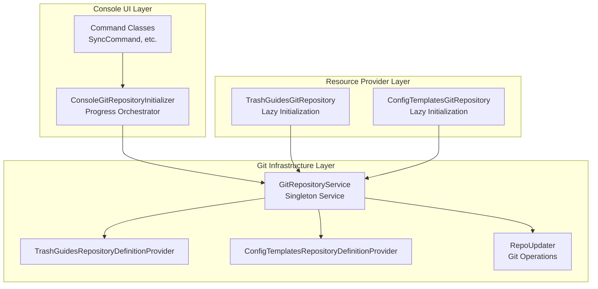
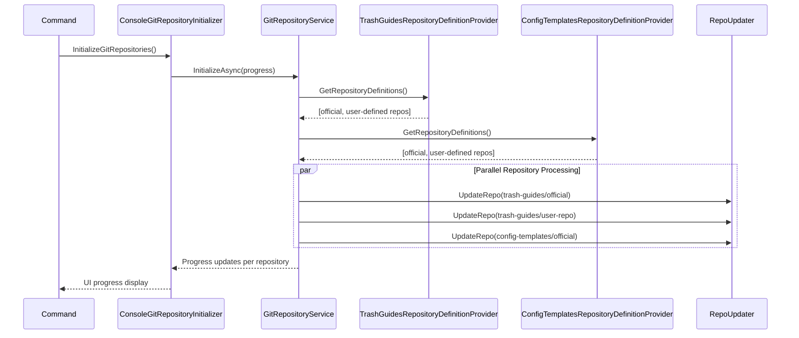
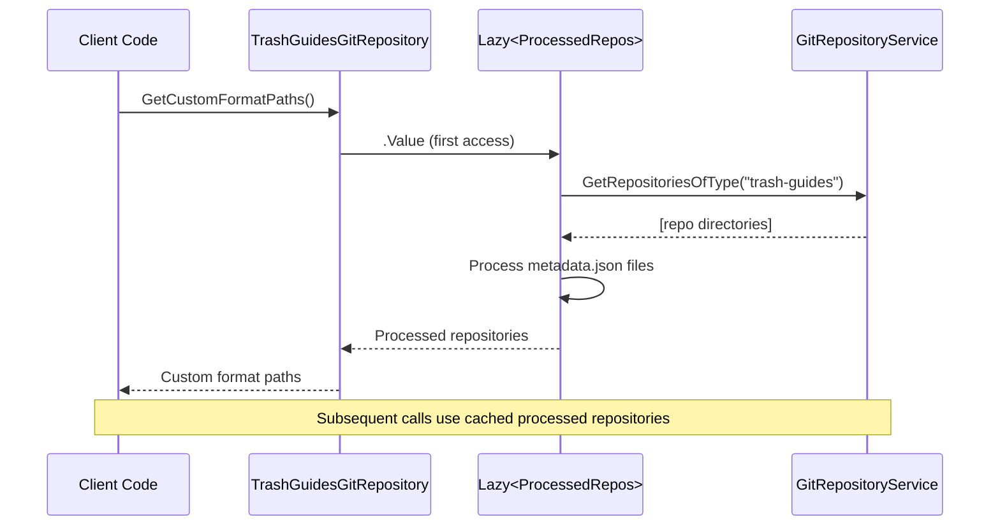

# Git Repository Service Architecture

## Overview

The Git Repository Service architecture centralizes Git repository management for Recyclarr,
separating infrastructure concerns (Git operations, parallelization, progress tracking) from domain
logic (resource interpretation). This design eliminates code duplication, enables per-repository
progress tracking, and provides a clean extensibility model for new repository types.

## Architecture Components

### Core Services



### GitRepositoryService

**Purpose**: Central orchestrator for all Git repository operations across all repository types.

**Key Responsibilities**:

- Repository-type agnostic orchestration
- Parallel clone/update operations with per-repository progress tracking
- State management and caching of initialized repositories
- Legacy repository cleanup

**Public Interface**:

```csharp
public interface IGitRepositoryService
{
    bool IsInitialized { get; }
    Task InitializeAsync(IProgress<RepositoryProgress>? progress, CancellationToken ct);
    IEnumerable<IDirectoryInfo> GetRepositoriesOfType(string repositoryType);
}
```

**Implementation Details**:

- Singleton lifecycle in Autofac container
- Discovers all repositories via `IRepositoryDefinitionProvider[]`
- Parallel repository operations using `Task.WhenAll()`
- Thread-safe repository storage using locking
- Progress reporting with detailed per-repository status

### IRepositoryDefinitionProvider

**Purpose**: Domain-specific repository configuration abstraction that maintains Open-Closed
Principle.

**Interface**:

```csharp
public interface IRepositoryDefinitionProvider
{
    string RepositoryType { get; }
    IEnumerable<GitRepositorySource> GetRepositoryDefinitions();
}
```

**Implementations**:

#### TrashGuidesRepositoryDefinitionProvider

- **Repository Type**: "trash-guides"
- **Official Repository**: `https://github.com/TRaSH-Guides/Guides.git`
- **Settings Integration**: `settings.Value.TrashGuides.OfType<GitRepositorySource>()`
- **Domain Knowledge**: TRaSH Guides specific repository structure and requirements

#### ConfigTemplatesRepositoryDefinitionProvider

- **Repository Type**: "config-templates"
- **Official Repository**: `https://github.com/recyclarr/config-templates.git`
- **Settings Integration**: `settings.Value.ConfigTemplates.OfType<GitRepositorySource>()`
- **Domain Knowledge**: Config Templates specific repository structure and requirements

### Resource Providers (Refactored)

**Purpose**: Lightweight domain interpreters that consume pre-initialized Git repository data.

**Key Changes**:

- **Removed**: `Initialize()` method and all Git repository management code
- **Added**: `Lazy<T>` initialization for lightweight metadata processing
- **Preserved**: All existing resource provider interfaces and public APIs
- **Dependencies**: Inject `IGitRepositoryService` instead of Git infrastructure

#### TrashGuidesGitRepository

```csharp
internal class TrashGuidesGitRepository : ICustomFormatsResourceProvider,
    IQualitySizeResourceProvider, IMediaNamingResourceProvider, ICustomFormatCategoriesResourceProvider
{
    private readonly Lazy<Dictionary<string, ProcessedRepository>> _processedRepositories;

    public TrashGuidesGitRepository(IGitRepositoryService gitRepositoryService)
    {
        _processedRepositories = new Lazy<Dictionary<string, ProcessedRepository>>(() =>
        {
            // Lazy initialization: parse metadata.json from each repository
            var repositories = gitRepositoryService.GetRepositoriesOfType("trash-guides");
            // Process metadata and return processed repositories dictionary
        });
    }

    // All resource provider methods unchanged, using _processedRepositories.Value
}
```

#### ConfigTemplatesGitRepository

```csharp
public class ConfigTemplatesGitRepository : IConfigTemplatesResourceProvider, IConfigIncludesResourceProvider
{
    private readonly Lazy<List<IDirectoryInfo>> _repositoryPaths;

    public ConfigTemplatesGitRepository(IGitRepositoryService gitRepositoryService)
    {
        _repositoryPaths = new Lazy<List<IDirectoryInfo>>(() =>
        {
            // Lazy initialization: get repository paths
            return gitRepositoryService.GetRepositoriesOfType("config-templates").ToList();
        });
    }

    // All template loading methods unchanged, using _repositoryPaths.Value
}
```

### ConsoleGitRepositoryInitializer

**Purpose**: UI orchestrator for Git repository initialization with granular progress tracking.

**Key Features**:

- **Per-Repository Progress**: Shows individual repository clone/update status
- **Progress Phases**: Starting → Cloning → Completed/Failed for each repository
- **Error Handling**: Individual repository failures don't block others
- **Raw Output Support**: Bypasses progress UI when `IsRawOutputEnabled`

**Usage in Commands**:

```csharp
// Before (old pattern)
await providerInitializer.InitializeAllProviders(outputSettings, ct);

// After (new pattern)
await gitRepositoryInitializer.InitializeGitRepositories(outputSettings, ct);
```

## Sequence Diagrams

### Initialization Flow



### Resource Provider Access Flow



## Benefits Achieved

### Performance Benefits

- **Parallel Operations**: All Git repositories clone/update simultaneously
- **Lazy Resource Processing**: Metadata parsing only happens when resource provider methods are
  called
- **Caching**: Processed repository data is cached for subsequent access
- **Progress Granularity**: Per-repository progress enables better user experience

### Code Quality Benefits

- **DRY Principle**: Eliminated ~80 lines of duplicate Git management code
- **Single Responsibility**: Each class has one clear, focused purpose
- **Open-Closed Principle**: New repository types require zero changes to GitRepositoryService
- **Separation of Concerns**: Git infrastructure completely separated from domain logic

### Maintainability Benefits

- **Centralized Git Logic**: All Git operations managed in one location
- **Consistent Error Handling**: Standardized error handling across all repository types
- **Testability**: Clear boundaries make unit testing more straightforward
- **Documentation**: Well-defined interfaces and responsibilities

## Extension Points

### Adding New Repository Types

To add a new repository type, create:

1. **Repository Definition Provider**:

   ```csharp
   internal class MyCustomRepositoryDefinitionProvider : IRepositoryDefinitionProvider
   {
       public string RepositoryType => "my-custom-type";

       public IEnumerable<GitRepositorySource> GetRepositoryDefinitions()
       {
           // Define official repo + user-defined repos from settings
       }
   }
   ```

1. **Resource Provider** (if needed):

   ```csharp
   internal class MyCustomGitRepository : IMyCustomResourceProvider
   {
       private readonly Lazy<MyProcessedData> _processedData;

       public MyCustomGitRepository(IGitRepositoryService gitRepositoryService)
       {
           _processedData = new Lazy<MyProcessedData>(() =>
           {
               var repositories = gitRepositoryService.GetRepositoriesOfType("my-custom-type");
               // Process repository data as needed
           });
       }
   }
   ```

1. **Autofac Registration**:

   ```csharp
   builder.RegisterType<MyCustomRepositoryDefinitionProvider>()
       .As<IRepositoryDefinitionProvider>()
       .SingleInstance();

   builder.RegisterType<MyCustomGitRepository>()
       .AsImplementedInterfaces()
       .SingleInstance();
   ```

**No changes required** to GitRepositoryService or ConsoleGitRepositoryInitializer.

## Migration Notes

### Breaking Changes

- **IResourceProvider.Initialize()** method removed
- **ConsoleResourceProviderInitializer** renamed to **ConsoleGitRepositoryInitializer**
- **Method Rename**: `InitializeAllProviders()` → `InitializeGitRepositories()`

### Backward Compatibility

- **Resource Provider APIs**: All public resource provider methods remain unchanged
- **Settings**: No changes to user configuration files required
- **Behavior**: Identical functionality with improved performance and progress tracking

### Dependencies

- Resource providers now depend on `IGitRepositoryService` instead of Git infrastructure directly
- Repository definition providers require `ISettings<ResourceProviderSettings>` for settings access
- Console commands updated to use `ConsoleGitRepositoryInitializer`

## Testing Strategy

### Unit Tests

- **GitRepositoryService**: Mock `IRepositoryDefinitionProvider[]` and `IRepoUpdater`
- **Repository Definition Providers**: Test repository definition logic with mock settings
- **Resource Providers**: Test lazy initialization and resource path generation with mock
  `IGitRepositoryService`

### Integration Tests

- **End-to-End Initialization**: Verify complete flow from command to resource provider access
- **Progress Tracking**: Validate progress reporting accuracy and granularity
- **Error Scenarios**: Test individual repository failure handling

### Regression Tests

- **Resource Provider APIs**: Ensure all existing resource provider methods work identically
- **Settings Compatibility**: Verify existing user configurations continue working
- **Command Behavior**: Confirm all commands produce identical results with improved progress
  display
