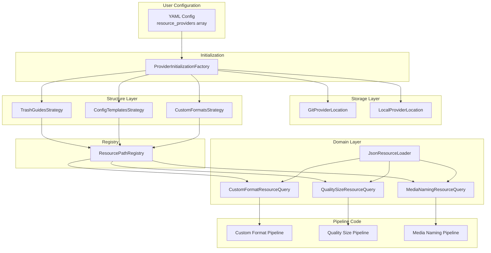

# Resource Provider System Architecture

## Executive Summary

The Resource Provider System enables users to specify custom data sources for Recyclarr while
maintaining clean separation between user configuration and implementation complexity.

**Problem Solved**: Previously, users were locked into official TRaSH Guides repositories. This
system enables custom forks, supplemental repositories, local directories for flat Custom Format
lists, and future support for HTTP APIs.

**Key Benefits**:

- **For Users**: Simple flat list configuration with explicit precedence control
- **For Developers**: Three-dimensional architecture (location × type × resource) with linear
  scaling and clean separation of concerns

## Core Concepts & Terminology

### Resource

Individual data element that Recyclarr processes:

- **Custom Format** - Quality filtering rule
- **Quality Size** - File size definition per quality level
- **Media Naming** - File and folder naming scheme
- **Config Template** - Reusable configuration snippet
- **Config Include** - Shared configuration fragment

### Provider

A configured data source where users store their data. Each provider has:

- **Name**: Globally unique identifier
- **Type**: What kind of data structure (trash-guides, config-templates, custom-formats)
- **Location**: Where data lives (Git repository or local directory)

### Provider Type

Indicates the structure and content of the provider. Each type is implemented via an
`IProviderTypeStrategy` that understands how to extract resources from the provider's structure:

- **trash-guides**: Full TRaSH Guides structure with metadata.json (Custom Formats, Quality Sizes,
  Media Naming)
- **config-templates**: Config Templates structure with metadata.json (Templates, Includes)
- **custom-formats**: Flat directory of Custom Format JSON files (no metadata.json required)

### Provider Location

How data is accessed:

- **Git Repository**: Cloned and cached in `cache/resources/{type}/git/{name}`
- **Local Directory**: User-managed directory referenced by path (no caching)

### Resource Query

Aggregation services that combine data from multiple providers, handling deduplication and providing
clean APIs to consuming code. Queries are service-agnostic with service-specific methods
(`GetRadarr()`, `GetSonarr()`).

### Three Dimensions

The system separates three orthogonal concerns:

1. **Provider Location** (Storage): How to access data (Git clone, local directory)
2. **Provider Type** (Structure): How data is organized (trash-guides, config-templates,
   custom-formats)
3. **Resource Type** (Domain): What the data represents (Custom Formats, Quality Sizes, Media
   Naming, etc.)

**Key Insight**: Any location can work with any type, producing any resource. This composability
eliminates combinatorial class explosion and enables linear scaling when adding new dimensions.

## System Architecture Overview

The system follows a layered architecture with clear separation of concerns:

```txt
User Configuration → Resource Providers → Resource Queries → Pipeline Code
```

### Architecture Flow



## Architectural Invariants

The system enforces several non-negotiable constraints that ensure correctness and maintainability:

### Type-Based Service Identification

All resource models use distinct types per service. A resource type MUST have service-specific
derived types, not a `Service` property:

- **Required**: `RadarrCustomFormatResource`, `SonarrCustomFormatResource`
- **Prohibited**: `CustomFormatResource` with `Service` enum property

**Rationale**: Type system prevents mixing Radarr resources with Sonarr pipelines at compile-time.
Registry uses types as keys, enabling type-safe resource retrieval.

### Resource Model Naming Convention

All resource models follow the pattern: `{Service}{ResourceType}Resource`

Examples: `RadarrQualitySizeResource`, `SonarrMediaNamingResource`, `RadarrConfigTemplateResource`

**Exception**: When structures differ per service (e.g., MediaNaming), separate classes are
justified without base record.

### Single Query Per Resource Type

Resource queries are NOT implemented once per service. A single query class serves all services with
service-specific methods:

- **Pattern**: `CustomFormatResourceQuery.GetRadarr()`, `CustomFormatResourceQuery.GetSonarr()`
- **Anti-Pattern**: `RadarrCustomFormatResourceQuery`, `SonarrCustomFormatResourceQuery`

**Rationale**: Query logic is identical across services (deduplication, loading, aggregation). DRY
compliance eliminates duplicate implementations.

### Registry 1:1 Type Mapping

`ResourceRegistry<TMetadata>` maintains strict 1:1 mapping between resource model types and their
metadata collections. One resource type maps to exactly one registered metadata collection.

**Generic Registry Pattern**:

The registry is parameterized by metadata type (`TMetadata`), enabling different metadata patterns
without code duplication:

- `ResourceRegistry<IFileInfo>` - For self-contained resources (CustomFormats, QualitySizes,
  MediaNaming, Categories). Metadata is the file itself.
- `ResourceRegistry<TemplateMetadata>` - For index-based resources (ConfigTemplates,
  ConfigIncludes). Metadata includes Id, TemplateFile, and Hidden flag.

**DI Registration**: Open generic registration (`RegisterGeneric(typeof(ResourceRegistry<>))`)
allows unlimited metadata types without additional registrations.

**Consequence**: Cannot reuse same type for different resources (e.g., using single `TemplatePath`
type for both templates and includes violates this invariant - requires distinct
`ConfigTemplateResource` and `ConfigIncludeResource` types).

### Precedence Via Registration Order

Resource precedence is determined by registration order, not explicit priority values:

1. Official providers registered first (lowest precedence)
2. User-configured providers registered in YAML order
3. Deduplication uses `.GroupBy(x => x.TrashId).Select(g => g.Last())`

**Result**: Last registered resource wins for duplicate TrashIds (bottom-up precedence).

## User Configuration Guide

### Configuration Structure

Flat array with bottom-up precedence (last provider wins for duplicate TrashIds):

```yaml
resource_providers:
  # Replace official trash guides with custom mirror
  - name: custom-mirror
    type: trash-guides
    clone_url: https://mirror.example.com/trash-guides.git
    replace_default: true

  # Supplemental local trash guides
  - name: my-local-guides
    type: trash-guides
    path: /home/user/resources/my-guides

  # Flat custom formats directory (service-specific)
  - name: my-radarr-cfs
    type: custom-formats
    path: /home/user/cfs/radarr
    service: radarr

  # Another flat CF directory for Sonarr
  - name: my-sonarr-cfs
    type: custom-formats
    path: /home/user/cfs/sonarr
    service: sonarr

  # Supplemental config templates
  - name: my-templates
    type: config-templates
    clone_url: https://github.com/user/my-templates.git
```

### Configuration Properties

**Base Properties** (all providers):

- `name`: Globally unique identifier (required)
- `type`: Provider type - `trash-guides`, `config-templates`, or `custom-formats` (required)
  - `trash-guides`: Requires `metadata.json` at root, follows TRaSH Guides structure
  - `config-templates`: Requires `metadata.json` at root, follows Config Templates structure
  - `custom-formats`: Flat directory of JSON files, no `metadata.json` required, requires `service`
    property for local paths
- `replace_default`: Boolean, replaces implicit official provider for this type (optional, default:
  false)

**Git Repository Location**:

- `clone_url`: Git repository URL (required)
- `reference`: Branch, tag, or SHA (optional, defaults to "master")

**Local Directory Location**:

- `path`: Directory path (required)
- `service`: Service identifier - `radarr` or `sonarr` (required only for `custom-formats` type)

### Precedence Model

**Bottom-up**: Last provider in list has highest precedence for duplicate TrashIds. Implicit
official providers are injected first (lowest precedence), then user-configured providers follow in
YAML order.

Example:

```yaml
resource_providers:
  # Implicit official injected here (lowest precedence)
  - name: my-supplements  # Medium precedence
    type: trash-guides
    path: /local/supplements
  - name: my-overrides    # Highest precedence (processed last)
    type: trash-guides
    path: /local/overrides
```

If multiple providers have CF with same TrashId, `my-overrides` wins.

### Default Behavior

**Zero Configuration**: Implicit official providers injected automatically:

- `trash-guides`: `https://github.com/TRaSH-Guides/Guides.git`
- `config-templates`: `https://github.com/recyclarr/config-templates.git`

**Replacing Defaults**: Use `replace_default: true` to prevent implicit injection:

```yaml
resource_providers:
  - name: my-custom-tg
    type: trash-guides
    path: /local/guides
    replace_default: true  # Official trash-guides NOT added
```

**Validation**: Only one provider per type can have `replace_default: true`.

## Implementation Architecture

### Three-Dimensional Architecture

#### Provider Location (Storage Layer)

Access data from storage and provide root filesystem paths.

- `GitProviderLocation`: Clones git repos to `cache/resources/{type}/git/{name}`, uses existing
  `IRepoUpdater` infrastructure
- `LocalProviderLocation`: Returns user-configured directory paths directly (no caching)

#### Provider Type (Structure Layer)

Understand provider organization and extract resource-specific file paths. Implemented via
`IProviderTypeStrategy`:

- `TrashGuidesStrategy`: Reads metadata.json, globs JSON files from configured paths, registers
  category markdown files
- `ConfigTemplatesStrategy`: Reads templates.json and includes.json, registers template/include
  files per service
- `CustomFormatsStrategy`: Treats root as flat directory of JSON files (service-specific)

Strategies also determine which official providers to inject based on `replace_default` settings.

#### Resource Types (Domain Layer)

Deserialize files into typed domain objects. Resource models use type-based service identification
(see Architectural Invariants). Base records with service-specific derived types enable DRY for
identical structures:

- `CustomFormatResource` → `RadarrCustomFormatResource`, `SonarrCustomFormatResource`
- `QualitySizeResource` → `RadarrQualitySizeResource`, `SonarrQualitySizeResource`
- `RadarrMediaNamingResource`, `SonarrMediaNamingResource` (different structures, no base)

### Core Abstractions

**ResourceRegistry\<TMetadata\>** (Type-Safe Generic Registry)

Generic registry parameterized by metadata type:

```csharp
public class ResourceRegistry<TMetadata> where TMetadata : class
{
    public void Register<TResource>(IEnumerable<TMetadata> metadata);
    public IReadOnlyCollection<TMetadata> Get<TResource>();
}
```

Two usage patterns:

- `ResourceRegistry<IFileInfo>` - For self-contained resources (CustomFormats, QualitySizes,
  MediaNaming). Strategy registers file paths, query deserializes via `JsonResourceLoader`.
- `ResourceRegistry<TemplateMetadata>` - For index-based resources (ConfigTemplates,
  ConfigIncludes). Strategy parses external metadata files and registers structured metadata, query
  transforms to resource objects.

Open generic DI registration (`RegisterGeneric(typeof(ResourceRegistry<>))`) creates registry
instances on demand. Preserves registration order for precedence.

**JsonResourceLoader** (Generic Deserialization)

Single loader for all resource types. Pure deserialization with no post-processing:

```csharp
public IEnumerable<TResource> Load<TResource>(IEnumerable<IFileInfo> files)
```

**Resource Queries** (Aggregation Layer)

Single query class per resource type with service-specific methods (`GetRadarr()`, `GetSonarr()`).
Two patterns based on metadata type:

- **File-based** (CustomFormats, QualitySizes, MediaNaming): Retrieve files from
  `ResourceRegistry<IFileInfo>`, deserialize via `JsonResourceLoader`, apply post-processing
  (category assignment), deduplicate by TrashId (last wins).
- **Index-based** (ConfigTemplates, ConfigIncludes): Retrieve metadata from
  `ResourceRegistry<TemplateMetadata>`, transform to resource objects, deduplicate by Id (last
  wins).

Both patterns preserve provider ordering for correct precedence semantics.

**ProviderInitializationFactory** (Orchestration)

Coordinates initialization with progress reporting:

1. Collects official providers from strategies (injected first)
2. Appends user-configured providers (YAML order preserved)
3. Creates location instances via delegate factories
4. Initializes locations asynchronously (git clone/fetch)
5. Calls strategies to register paths with registry
6. Triggers cache cleanup for orphaned directories

### Dependency Injection Pattern

**Key Patterns**:

- **Open generic registry**: `RegisterGeneric(typeof(ResourceRegistry<>))` creates instances for any
  metadata type without additional registrations
- **Keyed strategies**: `IProviderTypeStrategy` registered by provider type string ("trash-guides",
  "config-templates", "custom-formats")
- **Delegate factories**: Location classes registered as `AsSelf()` for Autofac auto-generated
  factories

All components registered in `ResourceProviderAutofacModule` as singletons except locations
(instance per dependency).

### Initialization Flow

Provider initialization occurs during application startup before command execution:

1. **Strategy Collection**: `ProviderInitializationFactory` queries all strategies to collect
   official providers (filtered by `replace_default` settings)
2. **Provider Ordering**: Official providers prepended (lowest precedence), user providers appended
   in YAML order
3. **Location Creation**: Delegate factories create location instances (`GitProviderLocation` or
   `LocalProviderLocation`) for each provider
4. **Async Initialization**: Locations initialize in sequence with progress reporting (git
   clone/fetch for git providers, path validation for local)
5. **Resource Registration**: Strategies call `MapResourcePaths()` to parse metadata and register
   files/metadata in appropriate `ResourceRegistry<TMetadata>` instances
6. **Cache Cleanup**: Cleanup service scans cache directory, deletes orphaned provider caches not in
   active set
7. **Query Availability**: Resource queries can now retrieve registered metadata and serve pipeline
   code

**Error Handling**: Factory catches initialization exceptions per provider, reports via progress,
continues with remaining providers. Partial initialization succeeds if at least one provider
completes successfully.

## Extension Guide

### Adding New Provider Locations

Implement `IProviderLocation` interface, add location-specific settings class, update factory to
recognize new config type. Achieves near-perfect Open/Closed compliance - no modifications to
existing locations, strategies, or loaders.

**Examples**: S3 bucket, HTTP API, database storage.

### Adding New Provider Types

Implement `IProviderTypeStrategy` interface defining `GetInitialProviders()` and
`MapResourcePaths()` logic, update schema validation, register via keyed DI. Achieves near-perfect
Open/Closed compliance - no modifications to existing strategies or locations.

**Examples**: Community guides structure, vendor-specific format repositories.

### Adding New Resource Types

Create base resource model with service-specific derived types following
`{Service}{ResourceType}Resource` naming convention, update provider strategies to register new
resource paths via `MapResourcePaths()`, create resource query with `GetRadarr()`/`GetSonarr()`
methods. Requires modifying existing strategies (acceptable moderate O/C violation - resource types
tied to Sonarr/Radarr capabilities, infrequent changes).

**Examples**: Release Profiles, custom lists, quality definitions.

## Migration Information

### User Configuration Backward Compatibility

**YAML Schema**: Full backward compatibility maintained. Legacy `repositories:` configuration
automatically migrated to `resource_providers:` via
`RepositoriesToResourceProvidersDeprecationCheck`:

```yaml
# Old (deprecated)
repositories:
  trash_guides:
    clone_url: https://custom.url
    branch: custom

# New (automatic transformation)
resource_providers:
  - name: official
    type: trash-guides
    clone_url: https://custom.url
    reference: custom
    replace_default: true
```

### Implementation Backward Compatibility

**Code**: No backward compatibility constraints. The resource provider system architecture can be
refactored freely as this feature is actively under development and not yet released to users.

## Validation Rules

Enforced via FluentValidation:

1. **Globally unique names**: No duplicate `name` values across all providers
2. **Single replace_default per type**: Only one provider per type can have `replace_default: true`
3. **Service required for custom-formats**: Local providers with `type: custom-formats` must have
   `service` property
4. **Valid type values**: Must be one of: trash-guides, config-templates, custom-formats
5. **Valid service values**: Must be one of: radarr, sonarr
