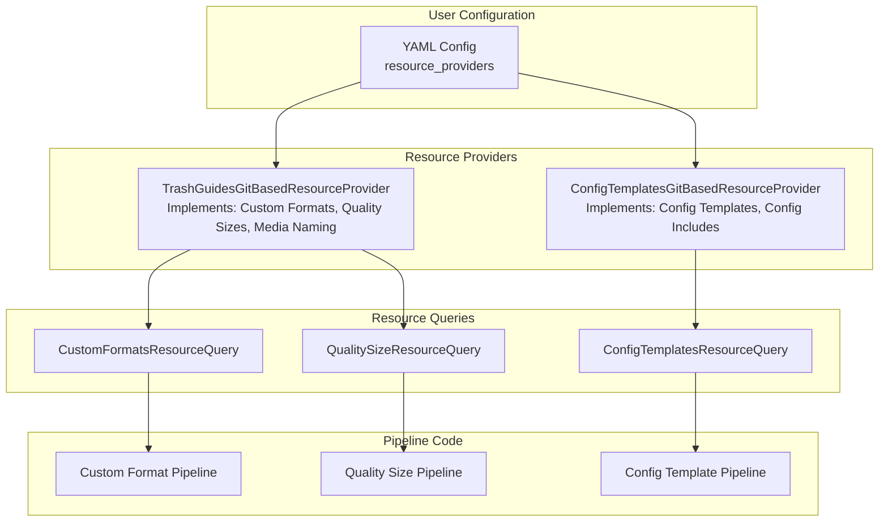

# Resource Provider System Architecture

## Executive Summary

The Resource Provider System enables users to specify custom data sources for Recyclarr while
maintaining clean separation between user configuration and implementation complexity.

**Problem Solved**: Previously, users were locked into official TRaSH Guides repositories. This
system enables custom forks, supplemental repositories, and future support for local directories and
HTTP APIs.

**Key Benefits**:

- **For Users**: Simple "here's where my data lives" configuration
- **For Developers**: Clean, extensible architecture with parallel processing and caching

## Core Concepts & Terminology

### Resource Types

Categories of data that Recyclarr processes:

- **Custom Formats** - Quality filtering rules
- **Quality Sizes** - File size definitions per quality
- **Media Naming** - File and folder naming schemes
- **Config Templates** - Reusable configuration snippets
- **Config Includes** - Shared configuration fragments

### Resource Provider

**User Context**: A data source where users store their data (Git repositories, local directories,
etc.)

**Code Context**: Implementation of resource type interfaces that provide access to specific
resource types. A single provider can implement multiple resource type interfaces.

### Resource Query

Aggregation services that combine data from multiple Resource Providers, handling deduplication,
caching, and providing clean APIs to consuming code.

**Key Insight**: Resource types have logical dependencies but aren't necessarily provided together
from the same sources.

## System Architecture Overview

The system follows a layered architecture with clear separation of concerns:

```txt
User Configuration → Resource Providers → Resource Queries → Pipeline Code
```

### Architecture Flow



### Key Components

**Resource Provider Interfaces**: Define contracts for specific resource types (e.g.,
`ICustomFormatsResourceProvider`, `IQualitySizeResourceProvider`)

**Resource Provider Implementations**: Classes that implement multiple resource type interfaces and
understand specific content structures (TRaSH Guides format, Config Templates format)

**Resource Queries**: Aggregate data from multiple providers, handle caching, and provide unified
APIs to pipeline code

## User Configuration Guide

### Configuration Structure

Users configure resource providers to tell Recyclarr where to find data:

```yaml
resource_providers:
  # TRaSH Guides repositories (Custom Formats, Quality Sizes, Media Naming)
  trash_guides:
    - clone_url: https://github.com/TRaSH-Guides/Guides.git
      name: official
      reference: master
    - clone_url: https://github.com/user/custom-trash-guides.git
      name: my-custom-guides
      reference: main

  # Config Template repositories (Config Templates, Config Includes)
  config_templates:
    - clone_url: https://github.com/recyclarr/config-templates.git
      name: official
      reference: master
    - clone_url: https://github.com/user/my-templates.git
      name: custom-templates
```

### Configuration Properties

**Git Repository Source Properties**:

- `name`: Unique identifier for this source (required)
- `clone_url`: Git repository URL (required)
- `reference`: Branch, tag, or commit SHA (optional, defaults to "master")

### Common Use Cases

**Fork Official Repository**: Replace the 'official' entry with your customized fork

**Supplemental Repository**: Add repositories with different names to provide additional data
alongside official sources

**Multiple Sources**: Use official repositories AND custom repositories together - all sources are
processed and aggregated

### Default Behavior

- **Zero Configuration**: Works out-of-the-box with official repositories
- **Override Official**: Use name "official" to replace default repositories
- **Supplement Official**: Add repositories with different names for additional data
- **Order Independent**: YAML order doesn't matter - all sources are processed together

## Implementation Architecture

### Resource Provider Pattern

Resource Providers implement multiple resource type interfaces:

```csharp
public class TrashGuidesGitBasedResourceProvider
    : ICustomFormatsResourceProvider,
      IQualitySizeResourceProvider,
      IMediaNamingResourceProvider
{
    public IEnumerable<IDirectoryInfo> GetCustomFormatPaths(SupportedServices service)
    {
        // Aggregate from ALL configured trash-guides repositories
        var allPaths = new List<IDirectoryInfo>();

        foreach (var repo in configuredRepositories)
        {
            // Extract paths from this repository's structure
            allPaths.AddRange(ExtractCustomFormatPaths(repo, service));
        }

        return allPaths;
    }
}
```

### Resource Query Pattern

Resource Queries aggregate data from multiple providers:

```csharp
public class CustomFormatsResourceQuery(
    IReadOnlyCollection<ICustomFormatsResourceProvider> providers
) : ICustomFormatsResourceQuery
{
    public CustomFormatDataResult GetCustomFormatData(SupportedServices serviceType)
    {
        var allFormats = new List<CustomFormatData>();

        // Aggregate from all providers
        foreach (var provider in providers)
        {
            var providerFormats = LoadFormatsFromProvider(provider, serviceType);
            allFormats.AddRange(providerFormats);
        }

        // Handle deduplication and composition
        return new CustomFormatDataResult(allFormats);
    }
}
```

### Dependency Injection Registration

```csharp
// Resource Providers (implement multiple interfaces)
builder.RegisterType<TrashGuidesGitBasedResourceProvider>()
    .AsImplementedInterfaces()
    .SingleInstance();

builder.RegisterType<ConfigTemplatesGitBasedResourceProvider>()
    .AsImplementedInterfaces()
    .SingleInstance();

// Resource Queries (aggregate from multiple providers)
builder.RegisterType<CustomFormatsResourceQuery>()
    .As<ICustomFormatsResourceQuery>()
    .SingleInstance();
```

## Extension Guide

### Adding New Resource Types

1. **Create Resource Provider Interface**:

   ```csharp
   public interface INewResourceProvider : IResourceProvider
   {
       IEnumerable<SomeDataType> GetNewResourceData(SupportedServices service);
   }
   ```

2. **Implement in Existing Provider** (if applicable):

   ```csharp
   public class TrashGuidesGitBasedResourceProvider
       : ICustomFormatsResourceProvider,
         INewResourceProvider // Add new interface
   {
       public IEnumerable<SomeDataType> GetNewResourceData(SupportedServices service)
       {
           // Implementation using existing repository processing
       }
   }
   ```

3. **Create Resource Query**:

   ```csharp
   public class NewResourceQuery(IReadOnlyCollection<INewResourceProvider> providers)
       : INewResourceQuery
   {
       // Standard aggregation pattern
   }
   ```

4. **Register in Autofac** (no changes to existing providers needed)

### Adding New Content Structures

To support a new repository format:

1. **Create Resource Provider Implementation**:

   ```csharp
   internal class NewContentResourceProvider
       : ICustomFormatsResourceProvider, IOtherResourceProvider
   {
       // Process content structure specific to this format
   }
   ```

2. **Register Component**:

   ```csharp
   builder.RegisterType<NewContentResourceProvider>()
       .AsImplementedInterfaces()
       .SingleInstance();
   ```

## Migration Information

### Legacy System Replacement

The Resource Provider system replaced legacy single-repository classes (`TrashGuidesRepo`,
`ConfigTemplatesRepo`) with a multi-source architecture.

**Migration Benefits**:

- **Parallel Operations**: All repositories clone/update simultaneously
- **Extensible Design**: New resource types require minimal changes
- **Eliminated Duplication**: Centralized processing logic

### Backward Compatibility

**User Configuration**: Legacy `repositories:` configuration automatically converted to
`resource_providers:` with deprecation warnings

**API Compatibility**: All Resource Provider interface methods remain unchanged

## Conclusion

The Resource Provider System successfully separates user configuration concerns from implementation
complexity:

**For Users**: Simple "here's where my data lives" configuration with flexible multi-source support

**For Developers**: Clean architecture with extensible patterns, parallel processing, and efficient
caching

The key insight is that **users care about data sources, not implementation abstractions**. By
aligning YAML configuration with user mental models while maintaining sophisticated internal
architecture, the system provides both simplicity and flexibility.
