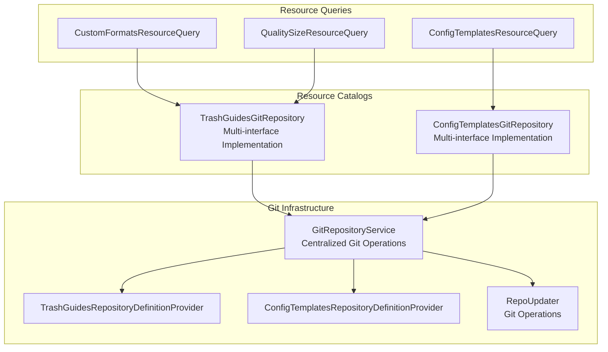
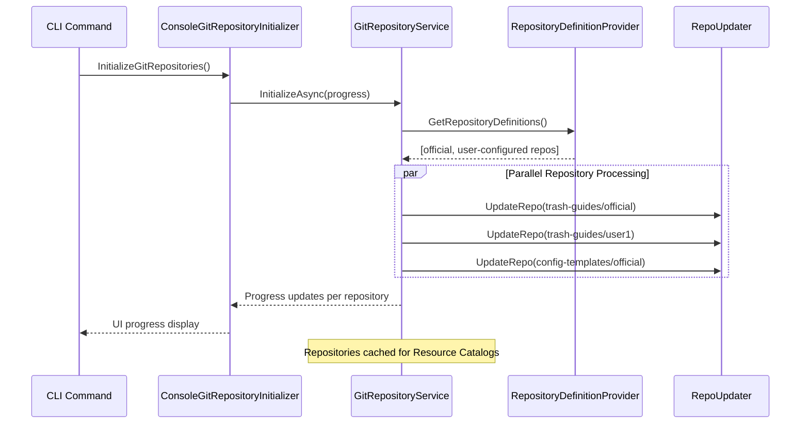
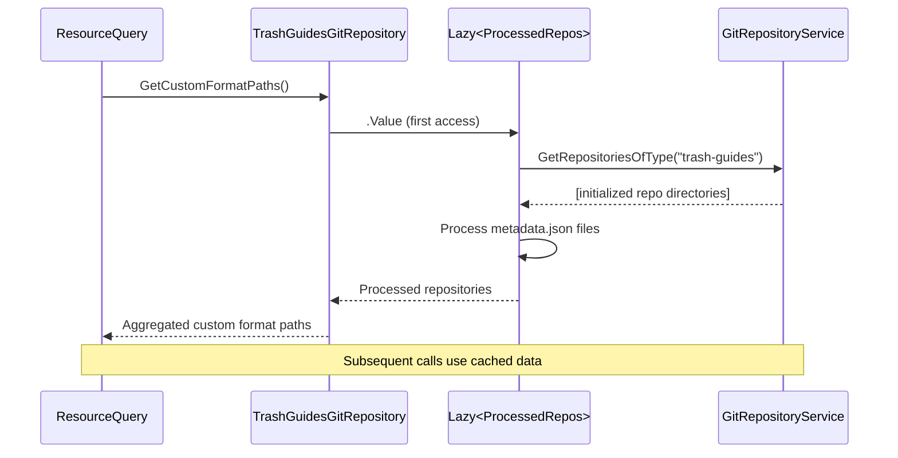

# Resource Provider System Architecture

## Overview

The Resource Provider System is Recyclarr's core architecture for obtaining and organizing data from
external sources. This system enables users to specify where Recyclarr should get the data it needs;
whether from the official TRaSH Guides, custom repositories, local directories, or future sources
like HTTP APIs.

**User Perspective**: The system allows users to say "Here's where my custom formats, quality
definitions, and templates live" without worrying about implementation details.

**Developer Perspective**: A clean, extensible architecture that separates user configuration
concerns from internal processing complexity.

## Design Philosophy

The architecture follows three core principles while maintaining a clear distinction between
user-facing and implementation concepts:

1. **User-Centric Configuration**: YAML structure focuses on "where users store data" rather than
   technical implementation details
2. **Implementation Flexibility**: Complex internal abstractions support multiple data sources and
   formats without exposing complexity to users
3. **Extensibility**: New source types and resource types can be added without breaking existing
   user configurations

## Terminology: User vs Implementation Perspectives

### User-Facing Concepts

From a user's perspective, the system is about **providing data to Recyclarr**:

**Resource Provider** (User Term): A place where users store data that Recyclarr needs

- **Example**: "I have a Git repository with custom formats"
- **Example**: "I have a local folder with quality definitions"
- **User Thinking**: "I want to provide custom formats to Recyclarr, here's where they are"

**Common User Scenarios**:

- **Fork Official Repository**: Replace the 'official' trash guides with a customized fork
- **Supplemental Repository**: Add custom data alongside official sources
- **Local Development**: Point to local directories during development
- **Alternative Sources**: Future support for HTTP APIs, databases, etc.

### Implementation Concepts

The code uses more granular abstractions to handle the complexity of multiple data sources:

#### Resource Provider Interface (Implementation Level)

**Definition**: Code interface that provides access to a specific resource type.

**Examples**: `ICustomFormatsResourceProvider`, `IQualitySizeResourceProvider`,
`IMediaNamingResourceProvider`

**Purpose**: Enables aggregation from multiple sources while maintaining type safety and clear
contracts.

#### Resource Catalog (Implementation Level)

**Definition**: Concrete implementation that understands how to extract multiple resource types from
a specific content structure.

**Examples**:

- `TrashGuidesGitRepository` - Knows how to parse TRaSH Guides repository structure (metadata.json,
  directory layouts)
- `ConfigTemplatesGitRepository` - Knows how to parse template repository structure (templates.json,
  includes.json)

**Key Insight**: These focus on **content structure knowledge**, not source type. A TRaSH Guides
structure could theoretically come from Git, HTTP API, or local filesystem.

#### Resource Query (Implementation Level)

**Definition**: Service that aggregates data from multiple Resource Catalogs to provide composed,
cached views.

**Examples**: `CustomFormatsResourceQuery`, `QualitySizeResourceQuery`,
`ConfigTemplatesResourceQuery`

**Purpose**: Handle data composition logic like duplicate detection, caching, and providing unified
views to consuming pipeline code.

#### Resource Type

**Definition**: Categories of data that Recyclarr works with.

**Examples**: Custom Formats, Quality Sizes, Media Naming, Config Templates, Config Includes

**User Relevance**: These are the types of data users think about: "I want to provide custom formats
to Recyclarr."

## User Configuration: Telling Recyclarr Where Your Data Lives

### YAML Configuration Structure

Users configure resource providers to tell Recyclarr where to find the data it needs:

```yaml
resource_providers:
  # "I have TRaSH Guides repositories"
  trash_guides:
    - clone_url: https://github.com/TRaSH-Guides/Guides.git
      name: official
      reference: master
    - clone_url: https://github.com/user/custom-trash-guides.git
      name: my-custom-guides
      reference: main

  # "I have Config Template repositories"
  config_templates:
    - clone_url: https://github.com/recyclarr/config-templates.git
      name: official
      reference: master
    - clone_url: https://github.com/user/my-templates.git
      name: custom-templates

  # Future: "I have custom formats in a local directory"
  # custom_formats:
  #   - path: /home/user/my-custom-formats-dir
```

### User Mental Model

**Primary User Goal**: "I want to maintain my own custom formats and media naming files without
forking the trash guides repo. I want Recyclarr to have access to those."

**User Thinking Process**:

1. **Resource Type Focus**: "I have custom formats I want to feed into Recyclarr"
2. **Source Flexibility**: "I can provide them via a TRaSH Guides repository, or (in the future) a
   local directory"
3. **Multiple Sources**: "I can use the official TRaSH Guides AND my custom repository together"

### Configuration Options

**For TRaSH Guides Content**:

- **Fork Official Repository**: Replace the 'official' entry with your customized fork
- **Supplemental Repository**: Add a new entry with your additional custom formats and naming
  schemes
- **Must follow TRaSH Guides structure**: Requires metadata.json and proper directory organization

**For Config Templates**:

- **Official Templates**: Pre-made configuration templates for easier Recyclarr setup
- **Custom Templates**: Your own reusable configuration snippets
- **Must follow Config Templates structure**: Requires templates.json and includes.json files

**Future Flexibility**: The system is designed to support additional source types like local
directories that don't require Git or complex structure - just the specific resource type files.

### Configuration Properties

**GitRepositorySource Properties**:

- `name`: Unique identifier for this source (required)
- `clone_url`: Git repository URL (required)
- `reference`: Branch, tag, or commit SHA (optional, defaults to "master")

### Default Behavior

- **Zero Configuration**: Recyclarr works out-of-the-box with official repositories
- **Override Official**: Use name "official" to replace default repositories with your fork
- **Supplement Official**: Add repositories with different names to provide additional data
- **Order Independent**: YAML order doesn't matter - all sources of the same type are processed
  together

### Implementation Mapping (Developer Reference)

**YAML Structure** → **Code Components**:

- `trash_guides:` → `TrashGuidesRepositoryDefinitionProvider` → `TrashGuidesGitRepository`
- `config_templates:` → `ConfigTemplatesRepositoryDefinitionProvider` →
  `ConfigTemplatesGitRepository`
- Individual entries → `GitRepositorySource` records processed by `GitRepositoryService`

## Architecture Components

### Git Infrastructure Layer


```mermaid
graph TB
    subgraph "Git Infrastructure"
        GRS[GitRepositoryService<br/>Centralized Git Operations]
        RDP1[TrashGuidesRepositoryDefinitionProvider]
        RDP2[ConfigTemplatesRepositoryDefinitionProvider]
        RU[RepoUpdater<br/>Git Operations]
    end

    subgraph "Resource Catalogs"
        TGRC[TrashGuidesGitRepository<br/>Multi-interface Implementation]
        CGRC[ConfigTemplatesGitRepository<br/>Multi-interface Implementation]
    end

    subgraph "Resource Queries"
        CFRQ[CustomFormatsResourceQuery]
        QSRQ[QualitySizeResourceQuery]
        CTRQ[ConfigTemplatesResourceQuery]
    end

    GRS --> RDP1
    GRS --> RDP2
    GRS --> RU
    TGRC --> GRS
    CGRC --> GRS
    CFRQ --> TGRC
    QSRQ --> TGRC
    CTRQ --> CGRC
```

#### GitRepositoryService

**Purpose**: Central orchestrator for all Git repository operations.

**Key Features**:

- Repository-type agnostic orchestration
- Parallel clone/update operations with per-repository progress tracking
- State management and caching of initialized repositories
- Lazy loading support for Resource Catalogs

#### Resource Catalogs Implementation Pattern

Resource Catalogs follow the **"Single Instance, Multiple Configurations"** pattern:

```csharp
public class TrashGuidesGitRepository(IGitRepositoryService gitRepositoryService)
    : ICustomFormatsResourceProvider,
      IQualitySizeResourceProvider,
      IMediaNamingResourceProvider,
      ICustomFormatCategoriesResourceProvider
{
    private readonly Lazy<Dictionary<string, ProcessedRepository>> _processedRepositories = new(() =>
    {
        // Process ALL configured repositories for this catalog type
        var repositories = gitRepositoryService.GetRepositoriesOfType("trash-guides");

        return repositories
            .Select(repoPath => (RepoPath: repoPath, MetadataFile: repoPath.File("metadata.json")))
            .Where(x => x.MetadataFile.Exists)
            .ToDictionary(
                x => x.RepoPath.Name,
                x => new ProcessedRepository(x.RepoPath, DeserializeMetadata(x.MetadataFile))
            );
    });

    public IEnumerable<IDirectoryInfo> GetCustomFormatPaths(SupportedServices service)
    {
        // Aggregate results from ALL configured repositories
        var allPaths = new List<IDirectoryInfo>();

        foreach (var repo in _processedRepositories.Value.Values)
        {
            var relativePaths = service switch
            {
                SupportedServices.Radarr => repo.Metadata.JsonPaths.Radarr.CustomFormats,
                SupportedServices.Sonarr => repo.Metadata.JsonPaths.Sonarr.CustomFormats,
                _ => throw new ArgumentOutOfRangeException(nameof(service))
            };

            allPaths.AddRange(relativePaths.Select(path => repo.RepoPath.SubDirectory(path)));
        }

        return allPaths;
    }
}
```

**Key Pattern Benefits**:

- **Standard DI Registration**: Simple `RegisterType<>().AsImplementedInterfaces().SingleInstance()`
- **Configuration Handling**: Each catalog handles multiple configurations internally
- **Efficiency**: Git repositories processed once, reused across all resource type methods
- **No Factory Complexity**: Eliminated factory pattern entirely

## Legacy System Migration

### What Was Replaced

The Resource Provider system replaced the following legacy components:

**Old Repository Classes** (Deleted):

- `TrashGuidesRepo` - Single-repository wrapper with limited functionality
- `ConfigTemplatesRepo` - Single-repository wrapper for templates
- `TrashRepoMetadataBuilder` - Metadata processing logic

**Old Infrastructure** (Deleted):

- `ConsoleMultiRepoUpdater` - Replaced by `ConsoleGitRepositoryInitializer`
- `IUpdateableRepo` - Repository update interface
- Multiple repository management classes

**Old Guide Services** (Transformed):

- `CustomFormatGuideService` → `CustomFormatsResourceQuery`
- `QualitySizeGuideService` → `QualitySizeResourceQuery`
- `MediaNamingGuideService` → `MediaNamingResourceQuery`
- `ConfigTemplateGuideService` → `ConfigTemplatesResourceQuery`

### Migration Benefits

**Code Quality**:

- **Eliminated Duplication**: Removed ~80 lines of duplicate Git management code
- **Single Responsibility**: Each class has one clear, focused purpose
- **Consistent Patterns**: All resource types follow identical patterns

**Performance**:

- **Parallel Operations**: All Git repositories clone/update simultaneously
- **Lazy Initialization**: Resource processing only happens when needed
- **Efficient Caching**: Processed data cached for subsequent access

**Maintainability**:

- **Centralized Git Logic**: All Git operations managed in one location
- **Clear Extension Points**: New resource types require minimal changes
- **Better Testability**: Clean boundaries for unit testing

## Resource Query Pattern

Resource Queries provide the aggregation layer that consumes multiple Resource Providers:

```csharp
public class CustomFormatsResourceQuery(
    IReadOnlyCollection<ICustomFormatsResourceProvider> customFormatsProviders,
    IReadOnlyCollection<ICustomFormatCategoriesResourceProvider> categoriesProviders,
    ICustomFormatLoader cfLoader,
    ILogger log
) : ICustomFormatsResourceQuery
{
    public CustomFormatDataResult GetCustomFormatData(SupportedServices serviceType)
    {
        var allFormatsWithSources = new List<(CustomFormatData Format, string Source)>();

        // Aggregate from all providers
        foreach (var provider in customFormatsProviders)
        {
            var providerPaths = provider.GetCustomFormatPaths(serviceType);
            var sourceDescription = provider.GetSourceDescription();
            var providerFormats = cfLoader.LoadAllCustomFormatsAtPaths(providerPaths, categoryFile);

            allFormatsWithSources.AddRange(
                providerFormats.Select(format => (format, sourceDescription))
            );
        }

        // Handle duplicate detection and clean data composition
        // ... (duplicate handling logic)

        return new CustomFormatDataResult(cleanFormats, duplicates);
    }
}
```

**Query Pattern Benefits**:

- **Provider Abstraction**: Doesn't care about implementation details of providers
- **Data Composition**: Handles aggregation logic like duplicate detection
- **Caching**: Expensive operations cached automatically
- **Error Collection**: Can collect and report issues from multiple sources

## Dependency Injection Registration

The system uses standard Autofac registration patterns:

```csharp
private static void RegisterResourceProviders(ContainerBuilder builder)
{
    // Repository Definition Providers (for GitRepositoryService)
    builder.RegisterType<TrashGuidesRepositoryDefinitionProvider>()
        .As<IRepositoryDefinitionProvider>()
        .SingleInstance();

    builder.RegisterType<ConfigTemplatesRepositoryDefinitionProvider>()
        .As<IRepositoryDefinitionProvider>()
        .SingleInstance();

    // Resource Catalogs (implement multiple provider interfaces)
    builder.RegisterType<TrashGuidesGitRepository>()
        .AsImplementedInterfaces() // Registers for all implemented interfaces
        .SingleInstance();

    builder.RegisterType<ConfigTemplatesGitRepository>()
        .AsImplementedInterfaces()
        .SingleInstance();

    // Resource Queries (aggregate from multiple providers)
    builder.RegisterType<CustomFormatsResourceQuery>()
        .As<ICustomFormatsResourceQuery>()
        .SingleInstance();

    // ... (other queries)
}
```

## Initialization Flow

The system initialization follows this sequence:


```mermaid
sequenceDiagram
    participant CLI as CLI Command
    participant CGRI as ConsoleGitRepositoryInitializer
    participant GRS as GitRepositoryService
    participant RDP as RepositoryDefinitionProvider
    participant RU as RepoUpdater

    CLI->>CGRI: InitializeGitRepositories()
    CGRI->>GRS: InitializeAsync(progress)

    GRS->>RDP: GetRepositoryDefinitions()
    RDP-->>GRS: [official, user-configured repos]

    par Parallel Repository Processing
        GRS->>RU: UpdateRepo(trash-guides/official)
        GRS->>RU: UpdateRepo(trash-guides/user1)
        GRS->>RU: UpdateRepo(config-templates/official)
    end

    GRS-->>CGRI: Progress updates per repository
    CGRI-->>CLI: UI progress display

    Note over GRS: Repositories cached for Resource Catalogs
```

## Data Access Flow

Resource Catalogs use lazy initialization for efficient data access:


```mermaid
sequenceDiagram
    participant Query as ResourceQuery
    participant Catalog as TrashGuidesGitRepository
    participant Lazy as Lazy<ProcessedRepos>
    participant GRS as GitRepositoryService

    Query->>Catalog: GetCustomFormatPaths()
    Catalog->>Lazy: .Value (first access)
    Lazy->>GRS: GetRepositoriesOfType("trash-guides")
    GRS-->>Lazy: [initialized repo directories]
    Lazy->>Lazy: Process metadata.json files
    Lazy-->>Catalog: Processed repositories
    Catalog-->>Query: Aggregated custom format paths

    Note over Query, GRS: Subsequent calls use cached data
```

## Extension Points

### Adding New Resource Types

To add a new resource type (e.g., `INewResourceProvider`):

1. **Create Resource Provider Interface**:

   ```csharp
   public interface INewResourceProvider : IResourceProvider
   {
       IEnumerable<SomeDataType> GetNewResourceData(SupportedServices service);
   }
   ```

2. **Implement in Existing Catalog** (if applicable):

   ```csharp
   public class TrashGuidesGitRepository : ICustomFormatsResourceProvider,
                                          INewResourceProvider // Add new interface
   {
       public IEnumerable<SomeDataType> GetNewResourceData(SupportedServices service)
       {
           // Implementation using existing _processedRepositories
       }
   }
   ```

3. **Create Resource Query**:

   ```csharp
   public class NewResourceQuery(IReadOnlyCollection<INewResourceProvider> providers)
       : INewResourceQuery
   {
       // Standard aggregation pattern
   }
   ```

4. **Register in Autofac** (no changes to existing catalogs needed):

   ```csharp
   builder.RegisterType<NewResourceQuery>()
       .As<INewResourceQuery>()
       .SingleInstance();
   ```

### Adding New Content Structures

To add a new content structure (e.g., a different repository format):

1. **Create Repository Definition Provider**:

   ```csharp
   internal class NewContentRepositoryDefinitionProvider : IRepositoryDefinitionProvider
   {
       public string RepositoryType => "new-content-type";

       public IEnumerable<GitRepositorySource> GetRepositoryDefinitions()
       {
           // Define repositories with this content structure
       }
   }
   ```

2. **Create Resource Catalog**:

   ```csharp
   internal class NewContentGitRepository(IGitRepositoryService gitRepositoryService)
       : ICustomFormatsResourceProvider, IOtherResourceProvider
   {
       private readonly Lazy<ProcessedData> _processedData = new(() =>
       {
           var repositories = gitRepositoryService.GetRepositoriesOfType("new-content-type");
           // Process content structure specific to this format
       });
   }
   ```

3. **Register Components**:

   ```csharp
   builder.RegisterType<NewContentRepositoryDefinitionProvider>()
       .As<IRepositoryDefinitionProvider>()
       .SingleInstance();

   builder.RegisterType<NewContentGitRepository>()
       .AsImplementedInterfaces()
       .SingleInstance();
   ```

**No changes required** to GitRepositoryService, ConsoleGitRepositoryInitializer, or existing
Resource Queries.

## Migration from Legacy System

### Breaking Changes

**Removed Components**:

- `IResourceProvider.Initialize()` method
- `ConsoleMultiRepoUpdater` class
- All legacy repository classes (`TrashGuidesRepo`, `ConfigTemplatesRepo`)

**Renamed Components**:

- `ConsoleResourceProviderInitializer` → `ConsoleGitRepositoryInitializer`
- `InitializeAllProviders()` → `InitializeGitRepositories()`

### Backward Compatibility

**Preserved APIs**:

- All Resource Provider interface methods remain unchanged
- User configuration files require no changes
- Identical functionality with improved performance and progress tracking

**Settings Migration**:

- Legacy `repositories:` configuration automatically converted to `resource_providers:`
- Deprecation warnings guide users to new format
- Both formats supported during transition

## Conclusion

The Resource Provider System successfully separates user configuration concerns from implementation
complexity:

### For Users

- **Simple Mental Model**: "Here's where my data lives" - no need to understand internal
  architecture
- **Flexible Configuration**: Support for multiple sources, with future extensibility for new source
  types
- **Zero-Configuration Default**: Works out-of-the-box while allowing customization when needed
- **Clear Use Cases**: Fork official repositories, supplement with custom data, or (future) use
  local directories

### For Developers

- **Clean Architecture**: Clear separation between user concerns and implementation details
- **Extensible Design**: New resource types and source types can be added without breaking existing
  configurations
- **Performance Optimizations**: Parallel processing, lazy loading, and efficient caching
- **Maintainable Code**: Standard patterns, eliminated duplication, and clear responsibilities

The system's key insight is that **users care about data sources, not implementation abstractions**.
By aligning the YAML configuration with user mental models while maintaining sophisticated internal
architecture, the system provides both simplicity for users and flexibility for future development.
