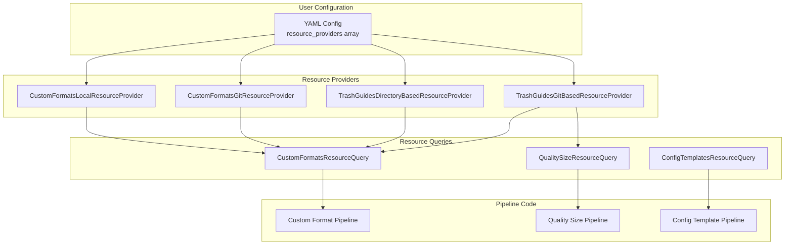

# Resource Provider System Architecture

## Executive Summary

The Resource Provider System enables users to specify custom data sources for Recyclarr while
maintaining clean separation between user configuration and implementation complexity.

**Problem Solved**: Previously, users were locked into official TRaSH Guides repositories. This
system enables custom forks, supplemental repositories, local directories for flat Custom Format
lists, and future support for HTTP APIs.

**Key Benefits**:

- **For Users**: Simple flat list configuration with explicit precedence control
- **For Developers**: Clean, extensible architecture with parallel processing and caching

## Core Concepts & Terminology

### Resource

Individual data element that Recyclarr processes:

- **Custom Format** - Quality filtering rule
- **Quality Size** - File size definition per quality level
- **Media Naming** - File and folder naming scheme
- **Config Template** - Reusable configuration snippet
- **Config Include** - Shared configuration fragment

### Provider

A configured data source where users store their data. Each provider has:

- **Name**: Globally unique identifier
- **Type**: What kind of data structure (trash-guides, config-templates, custom-formats)
- **Location**: Where data lives (Git repository or local directory)

### Provider Type

Indicates the structure and content of the provider:

- **trash-guides**: Full TRaSH Guides structure with metadata.json (Custom Formats, Quality Sizes,
  Media Naming)
- **config-templates**: Config Templates structure with metadata.json (Templates, Includes)
- **custom-formats**: Flat directory of Custom Format JSON files (no metadata.json required)

### Provider Location

How data is accessed:

- **Git Repository**: Cloned and cached in `cache/resources/{type}/git/{name}`
- **Local Directory**: User-managed directory referenced by path (no caching)

### Resource Query

Aggregation services that combine data from multiple providers, handling deduplication, caching, and
providing clean APIs to consuming code.

## System Architecture Overview

The system follows a layered architecture with clear separation of concerns:

```txt
User Configuration → Resource Providers → Resource Queries → Pipeline Code
```

### Architecture Flow


```mermaid
graph TB
    subgraph "User Configuration"
        YC[YAML Config<br/>resource_providers array]
    end

    subgraph "Resource Providers"
        TGGIT[TrashGuidesGitBasedResourceProvider]
        TGDIR[TrashGuidesDirectoryBasedResourceProvider]
        CFGIT[CustomFormatsGitResourceProvider]
        CFLOCAL[CustomFormatsLocalResourceProvider]
    end

    subgraph "Resource Queries"
        CFQ[CustomFormatsResourceQuery]
        QSQ[QualitySizeResourceQuery]
        CTQ[ConfigTemplatesResourceQuery]
    end

    subgraph "Pipeline Code"
        CF[Custom Format Pipeline]
        QS[Quality Size Pipeline]
        CN[Config Template Pipeline]
    end

    YC --> TGGIT
    YC --> TGDIR
    YC --> CFGIT
    YC --> CFLOCAL
    TGGIT --> CFQ
    TGDIR --> CFQ
    CFGIT --> CFQ
    CFLOCAL --> CFQ
    TGGIT --> QSQ
    CFQ --> CF
    QSQ --> QS
    CTQ --> CN
```

## User Configuration Guide

### Configuration Structure

Flat array with bottom-up precedence (last provider wins for duplicate TrashIds):

```yaml
resource_providers:
  # Replace official trash guides with custom mirror
  - name: custom-mirror
    type: trash-guides
    clone_url: https://mirror.example.com/trash-guides.git
    replace_default: true

  # Supplemental local trash guides
  - name: my-local-guides
    type: trash-guides
    path: /home/user/resources/my-guides

  # Flat custom formats directory (service-specific)
  - name: my-radarr-cfs
    type: custom-formats
    path: /home/user/cfs/radarr
    service: radarr

  # Another flat CF directory for Sonarr
  - name: my-sonarr-cfs
    type: custom-formats
    path: /home/user/cfs/sonarr
    service: sonarr

  # Supplemental config templates
  - name: my-templates
    type: config-templates
    clone_url: https://github.com/user/my-templates.git
```

### Configuration Properties

**Base Properties** (all providers):

- `name`: Globally unique identifier (required)
- `type`: Provider type - `trash-guides`, `config-templates`, or `custom-formats` (required)
- `replace_default`: Boolean, replaces implicit official provider for this type (optional, default:
  false)

**Git Repository Location**:

- `clone_url`: Git repository URL (required)
- `reference`: Branch, tag, or SHA (optional, defaults to "master")

**Local Directory Location**:

- `path`: Directory path (required)
- `service`: Service identifier - `radarr` or `sonarr` (required only for `custom-formats` type)

### Provider Type Requirements

**trash-guides and config-templates**:

- Git repos or local directories must contain `metadata.json` at root
- Structure follows TRaSH Guides/Config Templates format

**custom-formats**:

- Flat directory of Custom Format JSON files
- No `metadata.json` required
- `service` property required (radarr or sonarr)
- Can be git repo or local directory

### Precedence Model

**Bottom-up**: Last provider in list has highest precedence for duplicate TrashIds.

Example:

```yaml
resource_providers:
  - name: official    # Lowest precedence (processed first)
    type: trash-guides
    clone_url: https://github.com/TRaSH-Guides/Guides.git
  - name: my-overrides  # Highest precedence (processed last)
    type: trash-guides
    path: /local/overrides
```

If both providers have CF with same TrashId, `my-overrides` wins.

### Default Behavior

**Zero Configuration**: Implicit official providers injected automatically:

- `trash-guides`: `https://github.com/TRaSH-Guides/Guides.git`
- `config-templates`: `https://github.com/recyclarr/config-templates.git`

**Replacing Defaults**: Use `replace_default: true` to prevent implicit injection:

```yaml
resource_providers:
  - name: my-custom-tg
    type: trash-guides
    path: /local/guides
    replace_default: true  # Official trash-guides NOT added
```

**Validation**: Only one provider per type can have `replace_default: true`.

## Directory Structure

### Cached Git Repositories

Pattern: `cache/resources/{type}/git/{name}`

Examples:

- `cache/resources/trash-guides/git/official`
- `cache/resources/trash-guides/git/my-custom`
- `cache/resources/custom-formats/git/cf-repo`
- `cache/resources/config-templates/git/official`

### Local Directories

User-managed, no caching. Recyclarr reads directly from configured paths.

## Implementation Architecture

### Resource Provider Pattern

Providers implement resource type interfaces based on their capabilities:

```csharp
internal class TrashGuidesGitBasedResourceProvider
    : ICustomFormatsResourceProvider,
      IQualitySizeResourceProvider,
      IMediaNamingResourceProvider
{
    public IEnumerable<IDirectoryInfo> GetCustomFormatPaths(SupportedServices service)
    {
        // Aggregate from ALL git-based trash-guides repositories
        var repositories = gitRepositoryService.GetRepositoriesOfType("trash-guides");
        // Extract paths from metadata.json in each repository
    }
}

internal class CustomFormatsLocalResourceProvider
    : ICustomFormatsResourceProvider
{
    public IEnumerable<IDirectoryInfo> GetCustomFormatPaths(SupportedServices service)
    {
        // Return local directories filtered by type and service
        return settings.Value.Providers
            .Where(p => p.Type == "custom-formats" &&
                        p is LocalResourceProvider local &&
                        local.Service == service.ToString().ToLower())
            .Cast<LocalResourceProvider>()
            .Select(p => fileSystem.DirectoryInfo.New(p.Path));
    }
}
```

### Resource Query Pattern

Queries aggregate from all providers implementing the interface:

```csharp
public class CustomFormatsResourceQuery(
    IReadOnlyCollection<ICustomFormatsResourceProvider> providers
) : ICustomFormatsResourceQuery
{
    public CustomFormatDataResult GetCustomFormatData(SupportedServices serviceType)
    {
        var allFormats = new List<CustomFormatData>();

        // Aggregate from all providers (git + local, trash-guides + custom-formats)
        foreach (var provider in providers)
        {
            var providerFormats = LoadFormatsFromProvider(provider, serviceType);
            allFormats.AddRange(providerFormats);
        }

        // Handle deduplication (last provider wins)
        return DeduplicateByTrashId(allFormats);
    }
}
```

### Repository Definition Providers

Map settings to git repositories for caching:

```csharp
internal class TrashGuidesRepositoryDefinitionProvider : BaseRepositoryDefinitionProvider
{
    public override string RepositoryType => "trash-guides";

    protected override IReadOnlyCollection<ResourceProvider> GetUserProviders()
    {
        return settings.Value.Providers;
    }

    protected override GitResourceProvider CreateOfficialRepository()
    {
        return new GitResourceProvider
        {
            Name = "official",
            Type = "trash-guides",
            CloneUrl = new Uri("https://github.com/TRaSH-Guides/Guides.git"),
            Reference = "master",
        };
    }
}
```

### Dependency Injection Registration

```csharp
// Git-based providers
builder.RegisterType<TrashGuidesGitBasedResourceProvider>()
    .AsImplementedInterfaces()
    .SingleInstance();

builder.RegisterType<ConfigTemplatesGitBasedResourceProvider>()
    .AsImplementedInterfaces()
    .SingleInstance();

builder.RegisterType<CustomFormatsGitResourceProvider>()
    .AsImplementedInterfaces()
    .SingleInstance();

// Directory-based providers
builder.RegisterType<TrashGuidesDirectoryBasedResourceProvider>()
    .AsImplementedInterfaces()
    .SingleInstance();

builder.RegisterType<CustomFormatsLocalResourceProvider>()
    .AsImplementedInterfaces()
    .SingleInstance();

// Resource Queries
builder.RegisterType<CustomFormatsResourceQuery>()
    .As<ICustomFormatsResourceQuery>()
    .SingleInstance();
```

## Extension Guide

### Adding New Provider Types

1. Add new value to `type` property schema
2. Create provider implementation implementing appropriate resource interfaces
3. Register in Autofac
4. Update validation if needed

### Adding New Resource Types

1. Create resource provider interface: `INewResourceProvider`
2. Implement in existing providers (trash-guides, config-templates, custom-formats)
3. Create resource query: `NewResourceQuery`
4. Register in Autofac

## Migration Information

### From Legacy `repositories:` Configuration

Automatic migration via `RepositoriesToResourceProvidersDeprecationCheck`:

```yaml
# Old (deprecated)
repositories:
  trash_guides:
    clone_url: https://custom.url
    branch: custom

# New (automatic transformation)
resource_providers:
  - name: official
    type: trash-guides
    clone_url: https://custom.url
    reference: custom
    replace_default: true
```

### Directory Structure Migration

- Old: `repositories/{type}/{name}`
- New: `cache/resources/{type}/git/{name}`

Migration handled by `DeleteLegacyRepositoriesDirMigrationStep` (non-required, user can skip).

## Validation Rules

Enforced via FluentValidation:

1. **Globally unique names**: No duplicate `name` values across all providers
2. **Single replace_default per type**: Only one provider per type can have `replace_default: true`
3. **Service required for custom-formats**: Local providers with `type: custom-formats` must have
   `service` property
4. **Valid type values**: Must be one of: trash-guides, config-templates, custom-formats
5. **Valid service values**: Must be one of: radarr, sonarr

## Conclusion

The refactored Resource Provider System provides:

- **Explicit precedence control** via bottom-up ordering
- **Simplified configuration** with flat provider array
- **Flat Custom Format support** without metadata.json requirements
- **Flexible default replacement** via `replace_default` flag
- **Clean terminology** (Provider, Provider Type, Provider Location, Resource)

Key insight: Users specify **where data lives** and **what type it is**. System handles everything
else.
