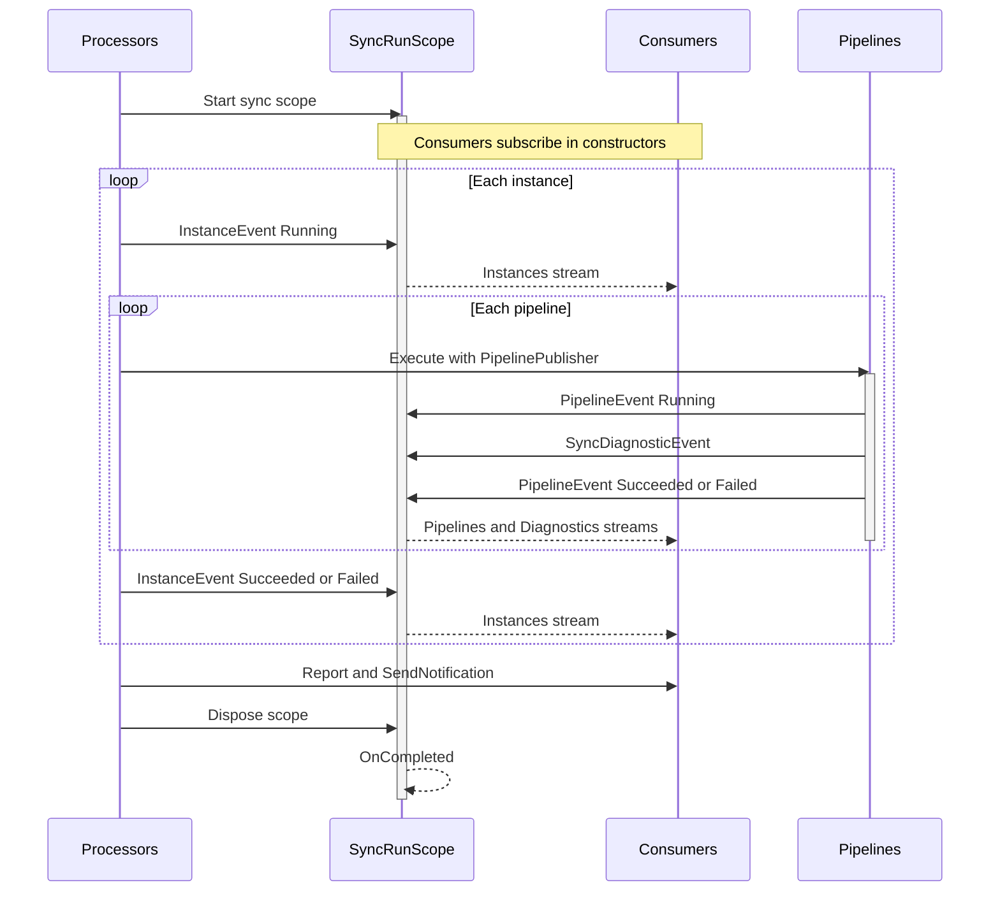

# Sync Event System

The sync event system provides a unified, observable-based approach for tracking sync run state. All
status changes, diagnostics, and progress flow as events through typed observables. Producers emit
events without knowing who consumes them; consumers subscribe to the streams they need.

This replaces three earlier systems that handled the same concerns inconsistently: a
BehaviorSubject-based progress source, an imperative `Add()`/`Clear()` diagnostic storage, and
ambient state for event attribution. The observable model eliminates all three in favor of a single
pattern.

## Scope Hierarchy

Sync execution uses nested Autofac lifetime scopes to manage component lifecycles and event
boundaries. Each scope level owns a distinct set of services, and disposal propagates from outer to
inner.

```txt
Root Container (singletons, shared infrastructure)
  |
  +-- "sync" scope (per sync run)
  |     SyncRunScope (event hub: ISyncRunScope + ISyncRunPublisher)
  |     SyncProcessor, SyncProgressRenderer, DiagnosticsRenderer
  |     NotificationService
  |
  +----+-- "instance" scope (per service instance, child of sync)
       |     InstancePublisher (IInstancePublisher)
       |     InstanceSyncProcessor, CompositeSyncPipeline
       |     IServiceConfiguration (the specific instance config)
       |     Pipeline services (GenericSyncPipeline<T>, phases, API services)
       |
       +-- PipelinePublisher (runtime object, not a scope)
             Created per pipeline by InstancePublisher.ForPipeline()
```

### Scope Wrappers

Named scopes are created through `LifetimeScopeFactory`, which begins a child scope and resolves a
wrapper type from it. Each wrapper is the single service-locator touch point for its scope;
everything else flows through constructor injection.

- `SyncScope` resolves `SyncProcessor` from the "sync" child scope.
- `InstanceScope` resolves `InstanceSyncProcessor` and `IInstancePublisher` from the "instance"
  child scope.

Both extend `LifetimeScopeWrapper`, which implements `IDisposable` to dispose the underlying Autofac
scope. `SyncCommand` creates and disposes the sync scope; `SyncProcessor` creates and disposes
instance scopes in a loop over configurations.

### DI Registration

Scope-bound registrations use `InstancePerMatchingLifetimeScope` to tie component lifetime to the
named scope:

```csharp
// CoreAutofacModule
builder.RegisterType<SyncRunScope>()
    .AsImplementedInterfaces()
    .InstancePerMatchingLifetimeScope("sync");

builder.RegisterType<InstancePublisher>()
    .As<IInstancePublisher>()
    .InstancePerMatchingLifetimeScope("instance");

// CompositionRoot
builder.RegisterMatchingScope("sync", b =>
{
    b.RegisterType<SyncScope>();
    b.RegisterType<SyncProcessor>();
    b.RegisterType<SyncProgressRenderer>();
});

builder.RegisterType<InstanceScope>();
builder.RegisterType<InstanceSyncProcessor>();
```

A noop `IInstancePublisher` is also registered at root scope for code paths that run outside a sync
context (composition root tests, state repair).

## Event Model

Three typed event streams flow through `SyncRunScope`, which holds one `Subject<T>` per stream:

| Stream        | Event type            | Carries                                                            |
|---------------|-----------------------|--------------------------------------------------------------------|
| `Instances`   | `InstanceEvent`       | Instance name, status (Pending/Running/Succeeded/Failed)           |
| `Pipelines`   | `PipelineEvent`       | Instance name, pipeline type, status, optional count               |
| `Diagnostics` | `SyncDiagnosticEvent` | Nullable instance name, level (Error/Warning/Deprecation), message |

All three inherit from `SyncRunEvent`, which exists solely to enable `Observable.Merge` in the
progress renderer. It is not used for polymorphic dispatch; consumers subscribe to the typed
observables directly.

### Why Three Separate Streams

Separate observables give compile-time safety: consumers subscribe to exactly what they need with no
`OfType<T>()` filtering. Rx composition operators (`Merge`, `Scan`, `CombineLatest`) work naturally
across independently typed streams.

### Producer/Consumer Interface Split

`SyncRunScope` implements two interfaces:

- `ISyncRunScope` (consumer-facing): exposes `IObservable<T>` properties for subscription.
- `ISyncRunPublisher` (producer-facing): exposes `Publish()` methods for each event type.

Consumers inject `ISyncRunScope`. Publishers never see it; they use `IInstancePublisher` or
`IPipelinePublisher` which internally delegate to `ISyncRunPublisher`.

On disposal, `SyncRunScope` calls `OnCompleted()` on all subjects, signaling end-of-run to any
operator that depends on stream completion (e.g., `ToList()`).

## Publishers

Publishers are layered objects that capture identity at creation, so callers emit events without
knowing their context. This provides the same ergonomics as ambient state but with explicit data
flow.

### IInstancePublisher

DI-managed, scoped to the "instance" lifetime. Takes `IServiceConfiguration` and `ISyncRunPublisher`
via constructor injection. Stamps the instance name on every event it emits.

Key behaviors:

- `SetStatus()` publishes an `InstanceEvent`.
- `AddError()` / `AddWarning()` / `AddDeprecation()` publish `SyncDiagnosticEvent` with the instance
  name.
- `HasErrors` tracks whether any errors were emitted, used by `InstanceSyncProcessor` to
  short-circuit after plan validation failures.
- `ForPipeline(PipelineType)` creates a `PipelinePublisher` for a specific pipeline.

### IPipelinePublisher

Runtime object, not DI-managed. Created by `InstancePublisher.ForPipeline()` for each pipeline
during orchestration. Stamps both instance name and pipeline type on events.

`CompositeSyncPipeline` creates one per pipeline and passes it to `GenericSyncPipeline.Execute()`,
which sets it on `PipelineContext.Publisher`. Pipeline phases access the publisher through the
context to emit status changes and diagnostics.

### Noop Implementations

Both interfaces provide static `Noop` properties (`IInstancePublisher.Noop`,
`IPipelinePublisher.Noop`) for contexts where event emission is unnecessary (tests, code paths
outside sync scope). `PipelineContext.Publisher` defaults to `IPipelinePublisher.Noop`.

## Consumers

All consumers inject `ISyncRunScope` and subscribe in their constructors. Events accumulate in lists
during the sync run. Explicit method calls from `SyncProcessor` trigger final processing after the
run completes.

### SyncProgressRenderer

Renders a live progress table showing instance and pipeline status.

Subscribes to both `Instances` and `Pipelines` streams via `Observable.Merge` (upcasting to
`SyncRunEvent`), then folds events into immutable `ProgressSnapshot` records using `Scan`. The
render loop polls the latest snapshot reference on a timer. Thread safety comes from `Scan`
producing immutable snapshots and `Subscribe` performing an atomic reference swap.

### DiagnosticsLogger

Subscribes to the `Diagnostics` stream and logs each event immediately via `ILogger` at the
appropriate level (Error, Warning). This ensures diagnostic messages appear when `--log` is active
(where `IAnsiConsole` output is suppressed). Has no explicit call site; activated by DI resolution in
`SyncProcessor`.

### DiagnosticsRenderer

Accumulates `SyncDiagnosticEvent` entries via a simple `Subscribe` that appends to a list.
`Report()` formats and renders errors and warnings to the console, grouped by severity and color
coded by instance.

### NotificationService

Subscribes to all three streams, accumulating events into separate lists. `SendNotification()`
derives overall success from `InstanceEvent` statuses, builds per-instance pipeline snapshots from
`PipelineEvent` groups, and formats diagnostics into the Apprise notification body.

### Why Explicit Calls Instead of OnCompleted

The original design had consumers react automatically when `SyncRunScope.Dispose()` fired
`OnCompleted()`. This was rejected for two reasons:

1. `NotificationService` does async HTTP work. Triggering it from an `OnCompleted` handler requires
   fire-and-forget or blocking, neither of which is acceptable.
2. Autofac disposes components in reverse-resolution order. Consumers that depend on `ISyncRunScope`
   would be disposed before `SyncRunScope` fires `OnCompleted`, causing the signal to arrive after
   the consumer is already torn down.

The current approach (eager `Subscribe` for accumulation, explicit `Report()` / `SendNotification()`
calls from `SyncProcessor`) is the least-surprise alternative.

## Event Flow Walkthrough



Participants map to concrete types as follows:

- **Processors**: `SyncCommand`, `SyncProcessor`, `InstanceSyncProcessor`, `CompositeSyncPipeline`
- **Hub**: `SyncRunScope` (the three Subjects behind `ISyncRunScope` / `ISyncRunPublisher`)
- **Consumers**: `SyncProgressRenderer`, `DiagnosticsLogger`, `DiagnosticsRenderer`, `NotificationService`
- **Pipelines**: `GenericSyncPipeline<TContext>` and its phases

## Relationship to Pipeline Architecture

This system handles status tracking and diagnostics for the sync run. It does not control pipeline
execution flow. For pipeline ordering, dependency cascading, phase execution, and the plan/pipeline
split, see [Sync Pipeline Architecture](sync-pipeline-architecture.md).
