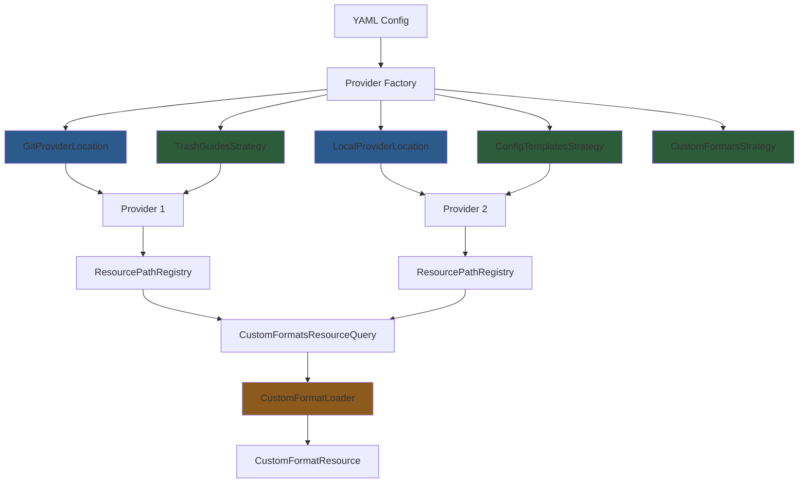

# Resource Provider System - Clean Slate Design

**Date:** 2025-01-08 **Status:** Proposed Architecture **Context:** Ground-up redesign based on
three orthogonal concerns: provider locations, provider types, resource types

## Document Scope

**This document is the authoritative source for both YAML schema and C# implementation
architecture.**

This document completely replaces `resource-provider-refactor-2025-01-07.md`. All prior design
iterations are obsolete and kept only for historical reference.

## YAML Configuration Schema

### Structure and Examples

Providers are configured as a flat list with explicit ordering for precedence control:

```yaml
resource_providers:
  # Git-based trash guides mirror replacing official
  - name: custom-mirror
    type: trash-guides
    clone_url: https://mirror.example.com/trash-guides.git
    reference: v1.2.3  # optional, defaults to "master"
    replace_default: true

  # Local trash guides structure (requires metadata.json)
  - name: my-local-guides
    type: trash-guides
    path: /home/user/resources/my-guides

  # Flat custom formats directory (service-specific)
  - name: my-radarr-cfs
    type: custom-formats
    path: /home/user/cfs/radarr
    service: radarr  # required for custom-formats type

  # Git-based config templates (official used implicitly if not replaced)
  - name: my-templates
    type: config-templates
    clone_url: https://github.com/user/my-templates.git
    reference: main
```

### Property Definitions

- `name`: Globally unique identifier across all providers. Used for cache directory naming.
- `type`: Provider type string - `trash-guides`, `config-templates`, or `custom-formats`.
- `clone_url` OR `path`: Discriminator for storage mechanism. Git providers use `clone_url` (URI),
  local providers use `path` (filesystem path).
- `reference`: Optional for git providers. Branch, tag, or SHA. Defaults to `"master"`.
- `service`: Required ONLY for `custom-formats` type. Must be `radarr` or `sonarr`. Prevents
  accidental misuse of service-specific custom format schemas.
- `replace_default`: Optional boolean. When `true`, prevents implicit injection of official provider
  for this provider type.

### Precedence Model

Bottom-up: Last provider in YAML list wins for duplicate resource TrashIds. Registration order in
code follows YAML order, with implicit official providers injected first (lowest precedence).

Example:

```yaml
resource_providers:
  # Provider A registered first
  - name: provider-a
    type: trash-guides
    path: /path/a

  # Provider B registered second - wins for duplicate TrashIds
  - name: provider-b
    type: trash-guides
    path: /path/b
```

If both providers have custom format with `trash_id: abc123`, provider B's version is used.

### Default Behavior (Zero Config)

If `resource_providers` section is omitted OR no providers configured for a type, implicit official
providers are injected automatically:

- `trash-guides` → `https://github.com/TRaSH-Guides/Guides.git` (name: `official`)
- `config-templates` → `https://github.com/recyclarr/config-templates.git` (name: `official`)
- `custom-formats` → No default provider

Enables zero-configuration usage - users can start without any `resource_providers` configuration.

### Validation Rules

- `name` must be globally unique across all providers.
- Only ONE provider per type can have `replace_default: true`. Multiple = validation error.
- `service` property is required for `type: custom-formats`, forbidden for other types.
- `clone_url` and `path` are mutually exclusive - exactly one must be present.

## Three-Dimensional Architecture

### Dimensions

1. **Provider Locations** (Storage Layer)
   - Responsibility: Access data, translate to filesystem paths
   - Examples: Git repos, local directories, S3 buckets
   - Output: Root directory paths on local filesystem

2. **Provider Types** (Structure Layer)
   - Responsibility: Understand organizational structure, extract resource-specific paths
   - Examples: trash-guides (metadata.json driven), config-templates (templates.json),
     custom-formats (flat)
   - Output: Typed mappings from root paths to resource-specific paths

3. **Resource Types** (Domain Layer)
   - Responsibility: Interpret file contents, build domain objects
   - Examples: Custom formats, quality sizes, naming, config templates
   - Output: Strongly-typed domain objects

### Key Insight: Separation of Concerns

```txt
Provider Location → Root Paths → Provider Type → Resource Paths → Resource Loader → Resource Models
```

## Resource Model Requirements

**ARCHITECTURAL INVARIANT:** All resources use type-based service identification. Each resource type
MUST have a distinct resource model class per service.

**Naming Convention:** Resource models follow a strict pattern:

**Pattern:** `{Service}{ResourceType}Resource`

Where:

- **Service**: Service name (e.g., `Radarr`, `Sonarr`) - ALWAYS required
- **ResourceType**: The resource type name (e.g., `CustomFormat`, `MediaNaming`, `QualitySize`,
  `ConfigTemplate`, `ConfigInclude`)

**DRY Pattern:** Resources with identical structure use inheritance to avoid duplication:

```csharp
public record CustomFormatResource { /* base properties */ }
public record RadarrCustomFormatResource : CustomFormatResource;
public record SonarrCustomFormatResource : CustomFormatResource;
```

**All Resource Types** (service-specific by design):

- `RadarrCategoryMarkdownResource` / `SonarrCategoryMarkdownResource` - Custom format category
  markdown files
- `RadarrCustomFormatResource` / `SonarrCustomFormatResource` - Custom format definitions
- `RadarrQualitySizeResource` / `SonarrQualitySizeResource` - Quality size profiles
- `RadarrMediaNamingResource` / `SonarrMediaNamingResource` - Media naming schemes
- `RadarrConfigTemplateResource` / `SonarrConfigTemplateResource` - Configuration templates
- `RadarrConfigIncludeResource` / `SonarrConfigIncludeResource` - Configuration includes

**Why Type-Based Service Identification:**

1. **Type Safety**: Registry uses resource model types as keys - service determined at compile-time
2. **Clean APIs**: No service parameters in loader/query interfaces - type system enforces
   correctness
3. **Registry Clarity**: `Register<RadarrCustomFormatResource>()` vs
   `Register<SonarrCustomFormatResource>()` - explicit and unambiguous
4. **Prevention**: Cannot accidentally mix Radarr resources with Sonarr pipelines

**Why This Matters:**

Even when resource structures are identical (e.g., CustomFormats), the data itself is
service-specific and incompatible. A Radarr custom format cannot be uploaded to Sonarr. Type-based
modeling enforces this domain constraint at compile-time.

This type-based service identification is non-negotiable for the architecture to function correctly.

## Resource Query Requirements

**ARCHITECTURAL INVARIANT:** Resource query classes are NOT implemented once per service. Instead, a
single query class serves all services with service-specific methods.

**Naming Convention:** Resource queries follow a strict pattern:

**Pattern:** `{ResourceType}ResourceQuery`

Where:

- **ResourceType**: The resource type name (e.g., `CustomFormat`, `MediaNaming`, `QualitySize`,
  `ConfigTemplate`, `ConfigInclude`, `Category`)
- **NO Service prefix** - query classes are service-agnostic

**Method Pattern:** Each query class provides service-specific methods:

```csharp
public class ConfigTemplateResourceQuery
{
    public IReadOnlyCollection<RadarrConfigTemplateResource> GetRadarr() { /* ... */ }
    public IReadOnlyCollection<SonarrConfigTemplateResource> GetSonarr() { /* ... */ }
}
```

**Examples:**

- `CustomFormatResourceQuery` with `GetRadarr()` and `GetSonarr()` methods
- `QualitySizeResourceQuery` with `GetRadarr()` and `GetSonarr()` methods
- `CategoryResourceQuery` with `GetRadarr()` and `GetSonarr()` methods
- `ConfigTemplateResourceQuery` with `GetRadarr()` and `GetSonarr()` methods
- `ConfigIncludeResourceQuery` with `GetRadarr()` and `GetSonarr()` methods

**Exception:** Media naming queries use separate classes (`RadarrMediaNamingResourceQuery`,
`SonarrMediaNamingResourceQuery`) due to different merge logic per service.

**Why Single Query Per Resource Type:**

1. **DRY Compliance**: Query logic is identical across services - deduplication, loading,
   aggregation
2. **Simplified DI**: Single registration per resource type instead of N registrations per service
3. **Clear Intent**: Method name explicitly identifies service (`GetRadarr()` vs `GetSonarr()`)
4. **Type Safety Preserved**: Return types are service-specific resource models

This query naming pattern is non-negotiable for architectural consistency.

## Core Abstractions

### 1. Provider Location (Storage Abstraction)

**Responsibility:** Knows how to access data from a storage mechanism and provides root directory
paths on the local filesystem. Owns cache path construction for storage types that require local
copies (git clones, S3 downloads). Doesn't understand what the data means or how it's organized -
just "here are the directories."

**Cache Path Structure:** `cache/resources/{provider-type}/{location-type}/{provider-name}`

Examples:

- `cache/resources/trash-guides/git/official`
- `cache/resources/custom-formats/git/my-formats`
- Local providers use no cache (direct filesystem access)

**Existing Infrastructure Reused:** Git locations leverage existing repo management:

- `IRepoUpdater` - defined at `src/Recyclarr.Core/Repo/IRepoUpdater.cs`
- `GitRepositorySource` - defined at `src/Recyclarr.Core/Repo/GitRepositorySource.cs`
- `RepoUpdater` implementation handles clone/fetch/checkout with retry logic

```csharp
// Progress reporting types
public record ProviderProgress(
    string ProviderType,
    string ProviderName,
    ProviderStatus Status,
    string? ErrorMessage = null
);

public enum ProviderStatus
{
    Processing,
    Completed,
    Failed
}

public interface IProviderLocation
{
    Task<IReadOnlyCollection<IDirectoryInfo>> InitializeAsync(
        IProgress<ProviderProgress>? progress,
        CancellationToken ct
    );
}

// Delegate factories for DI integration (Autofac auto-generates these)
public delegate GitProviderLocation GitLocationFactory(GitResourceProvider config);
public delegate LocalProviderLocation LocalLocationFactory(LocalResourceProvider config);

public class GitProviderLocation(
    GitResourceProvider config,
    IAppPaths appPaths,
    IRepoUpdater updater
) : IProviderLocation
{
    public async Task<IReadOnlyCollection<IDirectoryInfo>> InitializeAsync(
        IProgress<ProviderProgress>? progress,
        CancellationToken ct
    )
    {
        var cachePath = appPaths.ReposDirectory
            .SubDirectory(config.Type)
            .SubDirectory("git")
            .SubDirectory(config.Name);

        progress?.Report(new ProviderProgress(config.Type, config.Name, ProviderStatus.Processing));

        await updater.UpdateRepo(new GitRepositorySource
        {
            Name = config.Name,
            CloneUrl = config.CloneUrl,
            Reference = config.Reference,
            Path = cachePath
        }, ct);

        progress?.Report(new ProviderProgress(config.Type, config.Name, ProviderStatus.Completed));

        return [cachePath];
    }
}

public class LocalProviderLocation(
    LocalResourceProvider config,
    IFileSystem fileSystem
) : IProviderLocation
{
    public Task<IReadOnlyCollection<IDirectoryInfo>> InitializeAsync(
        IProgress<ProviderProgress>? progress,
        CancellationToken ct
    )
    {
        return Task.FromResult<IReadOnlyCollection<IDirectoryInfo>>(
            [fileSystem.DirectoryInfo.New(config.Path)]
        );
    }
}
```

### 2. Resource File Registry (Type-Safe File Mapping)

**Responsibility:** Global singleton that maps resource model types to their file lists. Strategies
register files during initialization (in YAML order), and loaders retrieve all files for a resource
type. Registration order determines precedence for deduplication.

**Key Design:** Strategies own file discovery (globbing directories, parsing metadata). Registry
stores the resolved file lists. Loaders are pure deserializers receiving ready-to-read files.

```csharp
public interface IResourcePathRegistry
{
    void Register<TResource>(IEnumerable<IFileInfo> files) where TResource : class;
    IReadOnlyCollection<IFileInfo> GetFiles<TResource>() where TResource : class;
}

public class ResourcePathRegistry : IResourcePathRegistry
{
    private readonly Dictionary<Type, List<IFileInfo>> _filesByResourceType = new();

    public void Register<TResource>(IEnumerable<IFileInfo> files) where TResource : class
    {
        var key = typeof(TResource);
        if (!_filesByResourceType.ContainsKey(key))
        {
            _filesByResourceType[key] = [];
        }
        _filesByResourceType[key].AddRange(files);
    }

    public IReadOnlyCollection<IFileInfo> GetFiles<TResource>() where TResource : class
    {
        var key = typeof(TResource);
        return _filesByResourceType.TryGetValue(key, out var files) ? files : [];
    }
}
```

### 3. Provider Type Strategy (Structure Awareness)

**Responsibility:** Understands how a provider type organizes its data. Provides initial providers
(e.g., official repositories) to inject based on configured providers. Given a root directory, knows
where to find each resource type. For example, TrashGuides reads metadata.json to find
CF/Quality/Naming paths, while CustomFormats treats the root as a flat CF directory.

**Existing Types Reused:** Strategies use existing metadata types from codebase:

- `RepoMetadata` (TrashGuides) - defined at `src/Recyclarr.Core/TrashGuide/RepoMetadata.cs`
- `TemplatesData` (ConfigTemplates) - defined at
  `src/Recyclarr.Core/ConfigTemplates/ConfigTemplatesResourceProvider.cs`

Deserialization methods are private helpers within strategy classes using appropriate
`GlobalJsonSerializerSettings`.

```csharp
public interface IProviderTypeStrategy
{
    string Type { get; }

    // Returns initial providers to inject (e.g., official) based on configured providers
    IReadOnlyCollection<ResourceProvider> GetInitialProviders(
        ResourceProviderSettings settings
    );

    void MapResourcePaths(
        ResourceProvider config,
        IDirectoryInfo rootPath,
        IResourcePathRegistry registry
    );
}

public class TrashGuidesStrategy : IProviderTypeStrategy
{
    public string Type => "trash-guides";

    public IReadOnlyCollection<ResourceProvider> GetInitialProviders(
        ResourceProviderSettings settings
    )
    {
        var official = new GitResourceProvider
        {
            Name = "official",
            Type = "trash-guides",
            CloneUrl = "https://github.com/TRaSH-Guides/Guides.git",
            Reference = "master"
        };

        var myProviders = settings.Providers.Where(p => p.Type == Type);

        // If any configured provider has replace_default, don't inject official
        return [official]
            .Where(_ => myProviders.All(p => !p.ReplaceDefault))
            .ToList();
    }

    public void MapResourcePaths(
        ResourceProvider config,
        IDirectoryInfo rootPath,
        IResourcePathRegistry registry
    )
    {
        var metadataFile = rootPath.File("metadata.json");
        if (!metadataFile.Exists)
            throw new InvalidDataException($"Provider {config.Name}: metadata.json not found");

        var metadata = DeserializeMetadata(metadataFile);

        // Register category markdown files using hardcoded paths (not in metadata.json)
        var radarrCategoryFile = rootPath.File("docs/Radarr/Radarr-collection-of-custom-formats.md");
        if (radarrCategoryFile.Exists)
        {
            registry.Register<RadarrCategoryMarkdownResource>([radarrCategoryFile]);
        }

        var sonarrCategoryFile = rootPath.File("docs/Sonarr/sonarr-collection-of-custom-formats.md");
        if (sonarrCategoryFile.Exists)
        {
            registry.Register<SonarrCategoryMarkdownResource>([sonarrCategoryFile]);
        }

        // Register Radarr resources - glob JSON files from metadata paths
        registry.Register<RadarrCustomFormatResource>(
            GlobJsonFiles(metadata.JsonPaths.Radarr.CustomFormats, rootPath)
        );
        registry.Register<RadarrQualitySizeResource>(
            GlobJsonFiles(metadata.JsonPaths.Radarr.Qualities, rootPath)
        );
        registry.Register<RadarrMediaNamingResource>(
            GlobJsonFiles(metadata.JsonPaths.Radarr.Naming, rootPath)
        );

        // Register Sonarr resources - glob JSON files from metadata paths
        registry.Register<SonarrCustomFormatResource>(
            GlobJsonFiles(metadata.JsonPaths.Sonarr.CustomFormats, rootPath)
        );
        registry.Register<SonarrQualitySizeResource>(
            GlobJsonFiles(metadata.JsonPaths.Sonarr.Qualities, rootPath)
        );
        registry.Register<SonarrMediaNamingResource>(
            GlobJsonFiles(metadata.JsonPaths.Sonarr.Naming, rootPath)
        );
    }

    private IEnumerable<IFileInfo> GlobJsonFiles(
        IEnumerable<string> relativePaths,
        IDirectoryInfo rootPath
    )
    {
        return relativePaths
            .Select(rootPath.SubDirectory)
            .Where(dir => dir.Exists)
            .SelectMany(dir => dir.EnumerateFiles("*.json", SearchOption.AllDirectories));
    }

    private static RepoMetadata DeserializeMetadata(IFileInfo jsonFile)
    {
        using var stream = jsonFile.OpenRead();
        return JsonSerializer.Deserialize<RepoMetadata>(stream, GlobalJsonSerializerSettings.Guide)
            ?? throw new InvalidDataException($"Unable to deserialize {jsonFile}");
    }
}

public class ConfigTemplatesStrategy : IProviderTypeStrategy
{
    public string Type => "config-templates";

    public IReadOnlyCollection<ResourceProvider> GetInitialProviders(
        ResourceProviderSettings settings
    )
    {
        var official = new GitResourceProvider
        {
            Name = "official",
            Type = "config-templates",
            CloneUrl = "https://github.com/recyclarr/config-templates.git",
            Reference = "master"
        };

        var myProviders = settings.Providers.Where(p => p.Type == Type);

        // If any configured provider has replace_default, don't inject official
        return [official]
            .Where(_ => myProviders.All(p => !p.ReplaceDefault))
            .ToList();
    }

    public void MapResourcePaths(
        ResourceProvider config,
        IDirectoryInfo rootPath,
        IResourcePathRegistry registry
    )
    {
        // Parse templates.json to get file paths per service
        var templatesFile = rootPath.File("templates.json");
        if (templatesFile.Exists)
        {
            var templatesData = DeserializeTemplatesData(templatesFile);

            registry.Register<RadarrConfigTemplateResource>(
                templatesData.Radarr.Select(e => rootPath.File(e.Template))
            );
            registry.Register<SonarrConfigTemplateResource>(
                templatesData.Sonarr.Select(e => rootPath.File(e.Template))
            );
        }

        // Parse includes.json to get file paths per service
        var includesFile = rootPath.File("includes.json");
        if (includesFile.Exists)
        {
            var includesData = DeserializeTemplatesData(includesFile);

            registry.Register<RadarrConfigIncludeResource>(
                includesData.Radarr.Select(e => rootPath.File(e.Template))
            );
            registry.Register<SonarrConfigIncludeResource>(
                includesData.Sonarr.Select(e => rootPath.File(e.Template))
            );
        }
    }

    private static TemplatesData DeserializeTemplatesData(IFileInfo jsonFile)
    {
        using var stream = jsonFile.OpenRead();
        return JsonSerializer.Deserialize<TemplatesData>(stream, GlobalJsonSerializerSettings.Recyclarr)
            ?? throw new InvalidDataException($"Unable to deserialize {jsonFile}");
    }
}

public class CustomFormatsStrategy(IFileSystem fs) : IProviderTypeStrategy
{
    public string Type => "custom-formats";

    public IReadOnlyCollection<ResourceProvider> GetInitialProviders(
        ResourceProviderSettings settings
    )
    {
        // No official provider for custom formats
        return [];
    }

    public void MapResourcePaths(
        ResourceProvider config,
        IDirectoryInfo rootPath,
        IResourcePathRegistry registry
    )
    {
        // Flat directory - glob all JSON files from root
        var files = rootPath.EnumerateFiles("*.json", SearchOption.AllDirectories);

        // Service property is required in YAML for custom-formats type
        // Cast to access service-specific config
        var customFormatConfig = (CustomFormatResourceProvider)config;

        if (customFormatConfig.Service == "radarr")
        {
            registry.Register<RadarrCustomFormatResource>(files);
        }
        else if (customFormatConfig.Service == "sonarr")
        {
            registry.Register<SonarrCustomFormatResource>(files);
        }
    }
}
```

### 4. Resource Loaders (Domain Interpretation)

**Responsibility:** Pure JSON deserialization - transform file contents into resource model objects.
No post-processing logic (handled by queries).

**Design Pattern:** Single generic `JsonResourceLoader` class. No interfaces needed - queries inject
loader directly via DI.

**Implementation:**

```csharp
public class JsonResourceLoader(IFileSystem fs)
{
    public IEnumerable<TResource> Load<TResource>(IEnumerable<IFileInfo> files)
        where TResource : class
    {
        return files
            .Select(file => fs.File.ReadAllText(file.FullName))
            .Select(json => JsonSerializer.Deserialize<TResource>(json))
            .Where(data => data is not null)
            .Cast<TResource>();
    }
}
```

**Return Type:** `IEnumerable<TResource>` enables efficient LINQ transformation pipelines without
intermediate collection conversions.

**Post-Processing:** Resource-specific logic (category assignment, validation, etc.) handled by
`ResourceQuery` classes after loading. Example:

```csharp
public class CustomFormatResourceQuery(...)
{
    public IReadOnlyCollection<RadarrCustomFormatResource> GetRadarr()
    {
        var files = registry.GetFiles<RadarrCustomFormatResource>();
        var loaded = loader.Load<RadarrCustomFormatResource>(files);
        var categories = categoryQuery.GetRadarr();

        return loaded
            .Select(cf => AssignCategory(cf, categories))
            .GroupBy(cf => cf.TrashId)
            .Select(g => g.Last())
            .ToList();
    }

    private static RadarrCustomFormatResource AssignCategory(
        RadarrCustomFormatResource cf,
        IEnumerable<CustomFormatCategoryItem> categories)
    {
        var match = categories.FirstOrDefault(cat =>
            cat.CfName.EqualsIgnoreCase(cf.Name) ||
            cat.CfAnchor.EqualsIgnoreCase(Path.GetFileNameWithoutExtension(cf.FileName)));

        return cf with { Category = match?.CategoryName };
    }
}
```

### 5. Resource Queries (Aggregation + Deduplication)

**Responsibility:** Retrieves all files for a resource type from the global registry, loads
resources from those files, and deduplicates by TrashId (last occurrence wins based on registration
order). Entry point for the rest of the system to get resources.

**Design Pattern:** Single query class per resource type with service-specific methods (GetRadarr,
GetSonarr). Eliminates duplication when query logic is identical across services. For resources with
different structures per service (e.g., MediaNaming), separate classes are justified.

```csharp
// Category query - provides categories for custom format assignment
public class CategoryResourceQuery(
    IResourcePathRegistry registry,
    ICustomFormatCategoryParser parser
)
{
    public IReadOnlyCollection<CustomFormatCategoryItem> GetRadarr()
    {
        var files = registry.GetFiles<RadarrCategoryMarkdownResource>();
        return files.SelectMany(parser.Parse).ToList();
    }

    public IReadOnlyCollection<CustomFormatCategoryItem> GetSonarr()
    {
        var files = registry.GetFiles<SonarrCategoryMarkdownResource>();
        return files.SelectMany(parser.Parse).ToList();
    }
}

// Custom format query - single class with service-specific methods
public class CustomFormatResourceQuery(
    IResourcePathRegistry registry,
    JsonResourceLoader loader,
    CategoryResourceQuery categoryQuery
)
{
    public IReadOnlyCollection<RadarrCustomFormatResource> GetRadarr()
    {
        var files = registry.GetFiles<RadarrCustomFormatResource>();
        var loaded = loader.Load<RadarrCustomFormatResource>(files);
        var categories = categoryQuery.GetRadarr();

        return loaded
            .Select(cf => AssignCategory(cf, categories))
            .GroupBy(cf => cf.TrashId)
            .Select(g => g.Last())
            .ToList();
    }

    public IReadOnlyCollection<SonarrCustomFormatResource> GetSonarr()
    {
        var files = registry.GetFiles<SonarrCustomFormatResource>();
        var loaded = loader.Load<SonarrCustomFormatResource>(files);
        var categories = categoryQuery.GetSonarr();

        return loaded
            .Select(cf => AssignCategory(cf, categories))
            .GroupBy(cf => cf.TrashId)
            .Select(g => g.Last())
            .ToList();
    }

    private static TResource AssignCategory<TResource>(
        TResource cf,
        IEnumerable<CustomFormatCategoryItem> categories
    ) where TResource : CustomFormatResource
    {
        var match = categories.FirstOrDefault(cat =>
            cat.CfName.EqualsIgnoreCase(cf.Name) ||
            cat.CfAnchor.EqualsIgnoreCase(Path.GetFileNameWithoutExtension(cf.FileName)));

        return cf with { Category = match?.CategoryName };
    }
}

// Quality size query - single class with service-specific methods
public class QualitySizeResourceQuery(
    IResourcePathRegistry registry,
    JsonResourceLoader loader
)
{
    public IReadOnlyCollection<RadarrQualitySizeResource> GetRadarr()
    {
        var files = registry.GetFiles<RadarrQualitySizeResource>();
        return loader.Load<RadarrQualitySizeResource>(files);
    }

    public IReadOnlyCollection<SonarrQualitySizeResource> GetSonarr()
    {
        var files = registry.GetFiles<SonarrQualitySizeResource>();
        return loader.Load<SonarrQualitySizeResource>(files);
    }
}

// Media naming queries - separate classes justified by different merge logic per service
public class RadarrMediaNamingResourceQuery(
    IResourcePathRegistry registry,
    JsonResourceLoader loader
)
{
    public RadarrMediaNamingResource GetNaming()
    {
        var files = registry.GetFiles<RadarrMediaNamingResource>();
        var allData = loader.Load<RadarrMediaNamingResource>(files);

        return new RadarrMediaNamingResource
        {
            File = MergeDictionaries(allData.Select(x => x.File)),
            Folder = MergeDictionaries(allData.Select(x => x.Folder))
        };
    }

    private static Dictionary<string, string> MergeDictionaries(
        IEnumerable<IReadOnlyDictionary<string, string>> dicts
    ) => dicts.SelectMany(d => d)
        .GroupBy(kvp => kvp.Key.ToLowerInvariant())
        .Select(g => g.Last())
        .ToDictionary(kvp => kvp.Key, kvp => kvp.Value);
}

public class SonarrMediaNamingResourceQuery(
    IResourcePathRegistry registry,
    JsonResourceLoader loader
)
{
    public SonarrMediaNamingResource GetNaming()
    {
        var files = registry.GetFiles<SonarrMediaNamingResource>();
        var allData = loader.Load<SonarrMediaNamingResource>(files);

        return new SonarrMediaNamingResource
        {
            Season = MergeDictionaries(allData.Select(x => x.Season)),
            Series = MergeDictionaries(allData.Select(x => x.Series)),
            Episodes = new SonarrEpisodeNamingData
            {
                Anime = MergeDictionaries(allData.Select(x => x.Episodes.Anime)),
                Daily = MergeDictionaries(allData.Select(x => x.Episodes.Daily)),
                Standard = MergeDictionaries(allData.Select(x => x.Episodes.Standard))
            }
        };
    }

    private static Dictionary<string, string> MergeDictionaries(
        IEnumerable<IReadOnlyDictionary<string, string>> dicts
    ) => dicts.SelectMany(d => d)
        .GroupBy(kvp => kvp.Key.ToLowerInvariant())
        .Select(g => g.Last())
        .ToDictionary(kvp => kvp.Key, kvp => kvp.Value);
}

// Template/include queries (return file metadata, not file contents)
public class RadarrConfigTemplateResourceQuery(
    IResourcePathRegistry registry
)
{
    public IReadOnlyCollection<RadarrConfigTemplateResource> GetTemplates()
    {
        var files = registry.GetFiles<RadarrConfigTemplateResource>();
        return files.Select(f => new RadarrConfigTemplateResource
        {
            Id = Path.GetFileNameWithoutExtension(f.Name),
            TemplateFile = f
        }).ToList();
    }
}
```

### 6. Resource Cache Cleanup Service

**Responsibility:** Removes orphaned cache directories when providers are removed from
configuration. Compares active cache paths (collected during initialization) against all existing
cache directories and deletes those no longer in use.

**Scope:** Only affects cached data (`cache/resources/`). Local provider paths are never deleted as
they reference user-managed directories.

```csharp
public interface IResourceCacheCleanupService
{
    void CleanupOrphans(IEnumerable<IDirectoryInfo> activePaths);
}

public class ResourceCacheCleanupService(IAppPaths appPaths, ILogger log)
    : IResourceCacheCleanupService
{
    public void CleanupOrphans(IEnumerable<IDirectoryInfo> activePaths)
    {
        if (!appPaths.ReposDirectory.Exists)
            return;

        var activeSet = activePaths.Select(p => p.FullName).ToHashSet();
        var allCachePaths = appPaths.ReposDirectory
            .EnumerateDirectories("*/*/*", SearchOption.TopDirectoryOnly);

        foreach (var orphan in allCachePaths.Where(p => !activeSet.Contains(p.FullName)))
        {
            log.Debug("Deleting orphaned cache: {Path}", orphan.FullName);
            orphan.Delete(recursive: true);
        }
    }
}
```

### 7. Provider Initialization Factory

**Responsibility:** Reads YAML configuration, coordinates with strategies to inject initial
providers (e.g., official repositories), creates location instances via delegate factories,
orchestrates async initialization with progress reporting, registers paths to the global registry,
and triggers orphaned cache cleanup.

**Integration:** Factory method must be called manually during application startup (async activation
not supported by Autofac). Progress reporting is handled via standard `IProgress<T>` pattern passed
from CLI layer.

```csharp
public class ProviderInitializationFactory(
    ISettings<ResourceProviderSettings> settings,
    IIndex<string, IProviderTypeStrategy> strategies,
    IResourcePathRegistry registry,
    IResourceCacheCleanupService cleanup,
    GitLocationFactory createGitLocation,
    LocalLocationFactory createLocalLocation,
    ILogger log
)
{
    public async Task InitializeProvidersAsync(
        IProgress<ProviderProgress>? progress,
        CancellationToken ct
    )
    {
        // Collect initial providers from all strategies (e.g., official repos)
        // Officials are injected first = lowest precedence in bottom-up model
        var providers = strategies.Values
            .SelectMany(s => s.GetInitialProviders(settings.Value))
            .Concat(settings.Value.Providers);

        var activePaths = new List<IDirectoryInfo>();

        foreach (var config in providers)
        {
            log.Information("Initializing provider: {Name} (type: {Type})",
                config.Name, config.Type);

            // Create location via delegate factory
            var location = CreateLocation(config);

            // Initialize asynchronously (downloads/clones), get root paths
            var roots = await location.InitializeAsync(progress, ct);
            activePaths.AddRange(roots);

            // Register files with global registry
            var strategy = strategies[config.Type];
            foreach (var root in roots)
            {
                strategy.MapResourcePaths(config, root, registry);
            }
        }

        // Cleanup orphaned caches after all providers initialized
        cleanup.CleanupOrphans(activePaths);
    }

    private IProviderLocation CreateLocation(ResourceProvider config)
    {
        return config switch
        {
            GitResourceProvider git => createGitLocation(git),
            LocalResourceProvider local => createLocalLocation(local),
            _ => throw new InvalidOperationException(
                $"Unknown provider type: {config.GetType().Name}"
            )
        };
    }
}
```

## DI Registration

```csharp
// Register global resource path registry (singleton)
builder.RegisterType<ResourcePathRegistry>()
    .As<IResourcePathRegistry>()
    .SingleInstance();

// Register strategies (keyed by provider type)
builder.RegisterType<TrashGuidesStrategy>().Keyed<IProviderTypeStrategy>("trash-guides");
builder.RegisterType<ConfigTemplatesStrategy>().Keyed<IProviderTypeStrategy>("config-templates");
builder.RegisterType<CustomFormatsStrategy>().Keyed<IProviderTypeStrategy>("custom-formats");

// Register provider locations (Autofac auto-generates delegate factories)
builder.RegisterType<GitProviderLocation>().AsSelf();
builder.RegisterType<LocalProviderLocation>().AsSelf();

// Register resource cache cleanup service
builder.RegisterType<ResourceCacheCleanupService>().As<IResourceCacheCleanupService>();

// Register provider initialization factory (manual initialization required)
builder.RegisterType<ProviderInitializationFactory>()
    .AsSelf()
    .SingleInstance();

// Register resource loader (single generic loader)
builder.RegisterType<JsonResourceLoader>().AsSelf().SingleInstance();

// Register category parser
builder.RegisterType<CustomFormatCategoryParser>().As<ICustomFormatCategoryParser>().SingleInstance();

// Register resource queries
builder.RegisterType<CategoryResourceQuery>().AsSelf().SingleInstance();
builder.RegisterType<CustomFormatResourceQuery>().AsSelf().SingleInstance();
builder.RegisterType<QualitySizeResourceQuery>().AsSelf().SingleInstance();
builder.RegisterType<RadarrMediaNamingResourceQuery>().AsSelf().SingleInstance();
builder.RegisterType<SonarrMediaNamingResourceQuery>().AsSelf().SingleInstance();
builder.RegisterType<RadarrConfigTemplateResourceQuery>().AsSelf().SingleInstance();
builder.RegisterType<SonarrConfigTemplateResourceQuery>().AsSelf().SingleInstance();
builder.RegisterType<RadarrConfigIncludeResourceQuery>().AsSelf().SingleInstance();
builder.RegisterType<SonarrConfigIncludeResourceQuery>().AsSelf().SingleInstance();

// Note: Initialization must be called manually at application startup:
// await container.Resolve<ProviderInitializationFactory>()
//     .InitializeProvidersAsync(progress, ct);
```

## Open/Closed Principle Analysis

### Adding New Provider Location (e.g., S3 Bucket)

**Required Changes:**

- Implement `IProviderLocation` interface
- Update DI registration to recognize new config type

**Modified Files:** 1 new file, 1 DI registration update

**Verdict:** ✅ **Near-perfect O/C compliance**. No modifications to existing location
implementations, type strategies, or resource loaders.

### Adding New Provider Type (e.g., "recyclarr-community")

**Required Changes:**

- Implement `IProviderTypeStrategy` interface
- Define how root paths map to resource paths
- Update DI keyed registration

**Modified Files:** 1 new file, 1 DI registration update

**Verdict:** ✅ **Near-perfect O/C compliance**. No modifications to existing strategies, locations,
or loaders.

### Adding New Resource Type (e.g., "Release Profiles")

**Required Changes:**

- Create resource model class `ReleaseProfileResource` (follows 1:1 invariant with *Resource suffix)
- Update provider type strategies to register paths for new resource
- Implement `IResourceLoader<ReleaseProfileResource>`
- Create resource query class

**Modified Files:**

- 1 new resource model class
- N provider type strategies (modify `MapResourcePaths` methods)
- 1 new loader
- 1 new query

**Verdict:** ⚠️ **Moderate O/C violation**. Requires modifying existing provider type strategies.

**Objective Assessment:**

**Is O/C violation for resource types acceptable?**

**Yes, for these reasons:**

1. **Infrequent Changes**: Resource types are tied to Sonarr/Radarr API capabilities. They change
   when those external systems change, not user demand.

2. **Domain Coupling**: Resource types are fundamental domain concepts. Adding one requires deep
   system knowledge regardless of architecture.

3. **Centralized Impact**: Modifications are localized to provider type strategies - a small,
   well-defined set of classes.

4. **Practical Tradeoff**: Achieving full O/C for resource types requires significant complexity
   (dynamic registration, reflection, convention-based discovery). The juice isn't worth the
   squeeze.

5. **Real Extensibility Need**: Users need to add provider locations and types (custom repos,
   mirrors, local dirs). They don't need to add resource types - that's system evolution, not user
   customization.

**What Objectively Matters for Extensibility:**

- ✅ Users can add custom provider locations (mirrors, local dirs) → ACHIEVED
- ✅ Users can add custom provider types (alternative structures) → ACHIEVED
- ❌ Users can add custom resource types → NOT NEEDED (and over-engineering to support)

The architecture optimizes for the right extensibility dimensions.

## Architecture Diagram



## Key Benefits

1. **Clean Separation**: Three dimensions (location, type, resource) fully decoupled
2. **Composability**: Any location × any type = valid provider
3. **Type Safety**: Generic resource registry prevents path/type mismatches
4. **Testability**: Mock locations, strategies, loaders independently
5. **Extensibility**: Add locations/types without modifying existing code
6. **Pragmatism**: Accepts reasonable O/C tradeoff for resource types

## Comparison to Current Combinatorial Design

**Current:**

- 3 provider types × 2 locations = 6 classes
- Add 4th type = 8 classes (+2)
- Add 3rd location = 12 classes (+6)

**Proposed:**

- 3 strategies + 2 locations + N loaders = 5+N classes
- Add 4th type = 6+N classes (+1)
- Add 3rd location = 6+N classes (+1)

**Linear scaling vs quadratic scaling.**

## Migration Strategy

1. **Phase 1**: Implement new abstractions alongside existing code
2. **Phase 2**: Migrate resource queries to new system one at a time (direct refactoring)
3. **Phase 3**: Remove old combinatorial provider classes
4. **Phase 4**: Update DI registration to new pattern

**Why No Adapters?**

This feature hasn't shipped to users - there are no external API contracts to maintain. Adapters
would be superfluous intermediate code that implies backward compatibility we explicitly don't need.
Direct refactoring is simpler than the adapter → migrate → remove dance. Per project guidelines:
refactor mercilessly and delete aggressively.

**Cleanup Candidates** (after migration complete):

- `GitRepositorySource` - replaced by location-specific initialization
- `BaseRepositoryDefinitionProvider` and subclasses - path construction moved to locations
- `GitRepositoryService` - functionality distributed to location implementations
- Combinatorial provider classes (e.g., `GitTrashGuidesProvider`, `LocalConfigTemplatesProvider`)

### Backward Compatibility

**YAML Schema**: Full backward compatibility required. Current settings models in
`ResourceProviderSettings.cs` are accurate and must be preserved. User configurations must continue
working without modification.

**Code**: No backward compatibility required. This feature has not shipped to users. All
implementation code from prior iterations can be completely refactored or removed without concern
for preserving old patterns. Delete aggressively during cleanup phases.

## Resource Model Transformations

All resource models already exist in the codebase as record types. Implementation requires creating
base records with service-specific derived types for DRY compliance and type-based service
identification.

### Base Records with Service-Specific Derived Types

**CategoryMarkdownResource → Service-Specific Types**

Location: `src/Recyclarr.Core/TrashGuide/CustomFormat/CategoryMarkdownResource.cs` (new file)

```csharp
// Marker types for category markdown files (no properties - just for registry typing)
public record CategoryMarkdownResource;
public record RadarrCategoryMarkdownResource : CategoryMarkdownResource;
public record SonarrCategoryMarkdownResource : CategoryMarkdownResource;
```

**CustomFormatData → Base + Derived Types**

Location: `src/Recyclarr.Core/TrashGuide/CustomFormat/CustomFormatData.cs`

```csharp
// Base record with all shared properties
public record CustomFormatResource
{
    public string? Category { get; init; }
    public string TrashId { get; init; } = "";
    public Dictionary<string, int> TrashScores { get; init; } =
        new(StringComparer.InvariantCultureIgnoreCase);
    public int? DefaultScore => TrashScores.TryGetValue("default", out var score) ? score : null;
    public int Id { get; set; }
    public string Name { get; init; } = "";
    public bool IncludeCustomFormatWhenRenaming { get; init; }
    public IReadOnlyCollection<CustomFormatSpecificationData> Specifications { get; init; } = [];
}

// Service-specific derived types (empty, inherit all from base)
public record RadarrCustomFormatResource : CustomFormatResource;
public record SonarrCustomFormatResource : CustomFormatResource;
```

**QualitySizeData → Base + Derived Types**

Location: `src/Recyclarr.Core/TrashGuide/QualitySize/QualitySizeData.cs`

```csharp
// Base record
public record QualitySizeResource
{
    public string Type { get; init; } = "";
    public IReadOnlyCollection<QualityItem> Qualities { get; init; } = [];
}

// Service-specific derived types
public record RadarrQualitySizeResource : QualitySizeResource;
public record SonarrQualitySizeResource : QualitySizeResource;
```

**TemplatePath → Base + Service-Specific Derived Types**

Location: `src/Recyclarr.Core/ConfigTemplates/IConfigTemplatesResourceQuery.cs:6`

```csharp
// Base record for shared structure
public record ConfigTemplateResource
{
    public required string Id { get; init; }
    public required IFileInfo TemplateFile { get; init; }
    public bool Hidden { get; init; }
}

// Service-specific derived types
public record RadarrConfigTemplateResource : ConfigTemplateResource;
public record SonarrConfigTemplateResource : ConfigTemplateResource;

// Same pattern for includes
public record ConfigIncludeResource
{
    public required string Id { get; init; }
    public required IFileInfo TemplateFile { get; init; }
    public bool Hidden { get; init; }
}

public record RadarrConfigIncludeResource : ConfigIncludeResource;
public record SonarrConfigIncludeResource : ConfigIncludeResource;
```

**MediaNamingData → Already Service-Specific**

Location: `src/Recyclarr.Core/TrashGuide/MediaNaming/`

```csharp
// These remain separate - structures differ per service
public record RadarrMediaNamingResource
{
    public IReadOnlyDictionary<string, string> Folder { get; init; } =
        new Dictionary<string, string>();
    public IReadOnlyDictionary<string, string> File { get; init; } =
        new Dictionary<string, string>();
}

public record SonarrMediaNamingResource
{
    public IReadOnlyDictionary<string, string> Season { get; init; } =
        new Dictionary<string, string>();
    public IReadOnlyDictionary<string, string> Series { get; init; } =
        new Dictionary<string, string>();
    public SonarrEpisodeNamingData Episodes { get; init; } = new();
}
```

**Key Observations:**

- All use record types (not classes)
- Base records contain all shared properties
- Service-specific derived types are empty (inherit everything from base)
- Media naming models remain separate (different structures per service)
- No `Service` property needed - type determines service

## Implementation Gaps & Open Items

**Status:** Cache management and initialization flow fully specified. Loader and query patterns
finalized.

### Resource Model Implementation Scope

**Decision:** Create base records with service-specific derived types throughout codebase.

**Rationale:** Type-based service identification enables compile-time safety and eliminates service
parameters from APIs. Base records maintain DRY compliance for identical structures.

**Implementation Order:**

1. Create `CustomFormatResource` base + `RadarrCustomFormatResource` / `SonarrCustomFormatResource`
   derived types
2. Create `QualitySizeResource` base + `RadarrQualitySizeResource` / `SonarrQualitySizeResource`
   derived types
3. Create `ConfigTemplateResource` base + service-specific derived types (remove Service property)
4. Create `ConfigIncludeResource` base + service-specific derived types (remove Service property)
5. Update all references throughout codebase to use appropriate service-specific type

### Code Structure and Organization

**Decision:** Three-directory structure organized by architectural concern.

```
src/Recyclarr.Core/ResourceProvider/
├── Storage/
│   ├── IProviderLocation.cs
│   ├── GitProviderLocation.cs
│   ├── LocalProviderLocation.cs
│   ├── IResourceCacheCleanupService.cs
│   └── ResourceCacheCleanupService.cs
├── Domain/
│   ├── CategoryMarkdownResource.cs
│   ├── CustomFormatResource.cs
│   ├── QualitySizeResource.cs
│   ├── RadarrMediaNamingResource.cs
│   ├── SonarrMediaNamingResource.cs
│   ├── ConfigTemplateResource.cs
│   ├── ConfigIncludeResource.cs
│   ├── JsonResourceLoader.cs
│   ├── CustomFormatLoader.cs
│   ├── CategoryResourceQuery.cs
│   ├── CustomFormatResourceQuery.cs
│   ├── QualitySizeResourceQuery.cs
│   ├── RadarrMediaNamingResourceQuery.cs
│   ├── SonarrMediaNamingResourceQuery.cs
│   ├── RadarrConfigTemplateResourceQuery.cs
│   ├── SonarrConfigTemplateResourceQuery.cs
│   ├── RadarrConfigIncludeResourceQuery.cs
│   └── SonarrConfigIncludeResourceQuery.cs
├── Infrastructure/
│   ├── IProviderTypeStrategy.cs
│   ├── TrashGuidesStrategy.cs
│   ├── ConfigTemplatesStrategy.cs
│   ├── CustomFormatsStrategy.cs
│   ├── IResourcePathRegistry.cs
│   ├── ResourcePathRegistry.cs
│   └── ProviderInitializationFactory.cs
└── ResourceProviderAutofacModule.cs
```

**Rationale:**

- **Storage/**: External integration boundary (filesystem access, cache management). Changes when
  adding new storage mechanisms (S3, HTTP, etc). 5 files.
- **Domain/**: Resource-centric business logic (models, loaders, queries). Changes when adding new
  resource types or modifying resource semantics. 18 files kept flat - tight coupling between
  resources/loaders/queries benefits from co-location.
- **Infrastructure/**: System plumbing (strategies, registry, factory). Changes when adding new
  provider types or modifying initialization flow. 7 files.

**Design Principles Applied:**

- Directories group by "why changes happen together" not mechanical type classification
- Interfaces co-located with implementations (no separate Interfaces/ folder)
- Flat Domain/ directory - 16 files manageable, naming prefixes provide visual grouping
- Avoids both extremes: not 20+ files flat, not 6+ subdirectories with 2-3 files each
- Structure reflects actual coupling rather than imposed taxonomy

## Loader and Query Design Summary

**Finalized Decisions:**

**Resource Loaders:**

- NO interfaces - loaders are concrete classes only
- No polymorphism needed - queries inject specific loader types
- Generic methods on concrete classes for reusable deserialization logic
- Concrete loaders for resource-specific logic (e.g., CustomFormatLoader with category assignment)
- Dependencies passed as method parameters, not constructor injection (e.g., categories passed to
  Load method)

**Resource Queries:**

- Single query class per resource type with service-specific methods (GetRadarr/GetSonarr)
- Eliminates duplication when query logic is identical across services
- Separate query classes only when logic genuinely differs (e.g., MediaNaming with different merge
  structures)
- CategoryResourceQuery is separate - queries don't inject each other; loaders receive dependencies
  as parameters
- No inheritance base classes - prefer simple, independent implementations (YAGNI)

**DI Registration Pattern:**

- Loaders registered as concrete classes (.AsSelf())
- Queries registered as concrete classes (.AsSelf())
- Category parser registered with interface for testing flexibility

## Next Steps for Implementation Session

- **Decide on Cleanup Service** - Include now or defer? Document decision rationale

**Critical Path:** Major gaps resolved (category files, metadata deserialization, git integration).
Remaining minor gaps (error handling patterns, validation messages) can be decided during
implementation with reasonable defaults.

## Implementation Impact Analysis

**Date:** 2025-01-09 **Status:** Comprehensive codebase review completed

This section documents all existing code that will be impacted by migrating to the new architecture,
including what will be replaced, what becomes irrelevant, test updates required, and critical design
gaps discovered.

### Code to be REPLACED (Deleted)

These classes/interfaces are directly replaced by new architecture components:

**1. Git Repository Infrastructure** (Replaced by `GitProviderLocation`)

- `src/Recyclarr.Core/ResourceProviders/Git/IGitRepositoryService.cs`
- `src/Recyclarr.Core/ResourceProviders/Git/GitRepositoryService.cs`
- `src/Recyclarr.Core/ResourceProviders/Git/IRepositoryDefinitionProvider.cs`
- `src/Recyclarr.Core/ResourceProviders/Git/BaseRepositoryDefinitionProvider.cs`
- `src/Recyclarr.Core/ResourceProviders/Git/TrashGuidesRepositoryDefinitionProvider.cs`
- `src/Recyclarr.Core/ResourceProviders/Git/ConfigTemplatesRepositoryDefinitionProvider.cs`
- `src/Recyclarr.Core/ResourceProviders/Git/RepositoryProgress.cs` → Becomes `ProviderProgress`
- `src/Recyclarr.Core/Repo/GitRepositorySource.cs` - Data model absorbed into location config

**Rationale:** Path construction, cache management, and git operations move entirely to
`GitProviderLocation`. Repository definition concept is replaced by provider type strategies
determining which providers to inject.

**2. TrashGuides Provider Classes** (Replaced by `TrashGuidesStrategy` + Locations)

- `src/Recyclarr.Core/TrashGuide/TrashGuidesResourceProvider.cs` (abstract base)
- `src/Recyclarr.Core/TrashGuide/TrashGuidesGitBasedResourceProvider.cs`
- `src/Recyclarr.Core/TrashGuide/TrashGuidesDirectoryBasedResourceProvider.cs`

**Rationale:** 2 implementations (Git × Directory) collapse into single `TrashGuidesStrategy` that
works with any location. Combinatorial explosion eliminated.

**3. ConfigTemplates Provider Classes** (Replaced by `ConfigTemplatesStrategy` + Locations)

- `src/Recyclarr.Core/ConfigTemplates/ConfigTemplatesResourceProvider.cs` (abstract base)
- `src/Recyclarr.Core/ConfigTemplates/ConfigTemplatesGitBasedResourceProvider.cs`
- `src/Recyclarr.Core/ConfigTemplates/ConfigTemplatesDirectoryBasedResourceProvider.cs`

**Rationale:** Same as TrashGuides - combinatorial explosion eliminated.

**4. Resource Provider Interfaces** (Replaced by `IResourceLoader<T>` + Registry)

- `src/Recyclarr.Core/TrashGuide/CustomFormat/ICustomFormatsResourceProvider.cs`
- `src/Recyclarr.Core/TrashGuide/CustomFormat/ICustomFormatCategoriesResourceProvider.cs`
- `src/Recyclarr.Core/TrashGuide/QualitySize/IQualitySizeResourceProvider.cs`
- `src/Recyclarr.Core/TrashGuide/MediaNaming/IMediaNamingResourceProvider.cs`
- `src/Recyclarr.Core/ConfigTemplates/IConfigTemplatesResourceProvider.cs`
- `src/Recyclarr.Core/ConfigTemplates/IConfigIncludesResourceProvider.cs`

**Rationale:** Resource path management moves to `IResourcePathRegistry`. Providers no longer return
paths per service - registry provides paths, loaders load data. Service-specific resources use
distinct model types.

**5. CLI Integration** (Deleted - No Longer Needed)

- `src/Recyclarr.Cli/Console/ConsoleGitRepositoryInitializer.cs`

**Rationale:** Git repos are no longer first-class citizens. Resource providers are the primary
abstraction. Commands call `ProviderInitializationFactory.InitializeProvidersAsync()` directly with
Spectre.Console progress rendering inline. ConsoleGitRepositoryInitializer becomes redundant.

### Code That Becomes IRRELEVANT (Cleanup Candidates)

These abstractions/interfaces exist only to support the combinatorial provider pattern:

**1. Base Resource Provider Interface**

- `src/Recyclarr.Core/ResourceProviders/IResourceProvider.cs` - Only defines `Name` property

**Status:** Appears unused in current implementation. Verify and remove if truly orphaned.

**2. Internal Abstractions from BaseRepositoryDefinitionProvider**

- `IUnderlyingResourceProvider` - Internal interface used by `BaseRepositoryDefinitionProvider` to
  abstract Git vs Local providers

**Rationale:** No longer needed with location/strategy separation.

### Resource Model Transformations (Renames + Split)

**CRITICAL:** These are PERVASIVE changes requiring find-and-replace across entire codebase.

**1. Rename Operations** (Global Find-Replace)

- `CustomFormatData` → `CustomFormatResource`
  - Location: `src/Recyclarr.Core/TrashGuide/CustomFormat/CustomFormatData.cs`
  - Usages: Throughout pipelines, loaders, queries, tests
- `QualitySizeData` → `QualitySizeResource`
  - Location: `src/Recyclarr.Core/TrashGuide/QualitySize/QualitySizeData.cs`
  - Usages: Throughout pipelines, loaders, queries, tests
- `RadarrMediaNamingData` → `RadarrMediaNamingResource`
  - Location: `src/Recyclarr.Core/TrashGuide/MediaNaming/RadarrMediaNamingData.cs`
  - Usages: Throughout Radarr-specific pipelines, queries, tests
- `SonarrMediaNamingData` → `SonarrMediaNamingResource`
  - Location: `src/Recyclarr.Core/TrashGuide/MediaNaming/SonarrMediaNamingData.cs`
  - Usages: Throughout Sonarr-specific pipelines, queries, tests

**2. Split Operation** (Breaks 1:1 Invariant Violation)

- `TemplatePath` → `ConfigTemplateResource` + `ConfigIncludeResource`
  - Current location: `src/Recyclarr.Core/ConfigTemplates/IConfigTemplatesResourceQuery.cs:6`
  - **Problem:** Single type used for two resource types (templates AND includes) violates registry
    1:1 invariant
  - **Solution:** Create two structurally identical but type-distinct records
  - **Impact:** Update all template/include query and processor code to use distinct types

### DI Registration Changes

**Module:** `src/Recyclarr.Core/CoreAutofacModule.cs`

**REMOVE Registrations:**

```csharp
// Old git infrastructure
builder.RegisterType<GitRepositoryService>().As<IGitRepositoryService>().SingleInstance();
builder.RegisterType<TrashGuidesRepositoryDefinitionProvider>()
    .As<IRepositoryDefinitionProvider>().SingleInstance();
builder.RegisterType<ConfigTemplatesRepositoryDefinitionProvider>()
    .As<IRepositoryDefinitionProvider>().SingleInstance();

// Old provider classes (combinatorial)
builder.RegisterType<TrashGuidesGitBasedResourceProvider>()
    .AsImplementedInterfaces().SingleInstance();
builder.RegisterType<TrashGuidesDirectoryBasedResourceProvider>()
    .AsImplementedInterfaces().SingleInstance();
builder.RegisterType<ConfigTemplatesGitBasedResourceProvider>()
    .AsImplementedInterfaces().SingleInstance();
builder.RegisterType<ConfigTemplatesDirectoryBasedResourceProvider>()
    .AsImplementedInterfaces().SingleInstance();
```

**ADD Registrations:** (See DI Registration section in main design)

### Test Impact Assessment

**1. BaseRepositoryDefinitionProviderTest** (`tests/Recyclarr.Core.Tests/Git/`)

**Status:** DELETE or REPLACE

**Current Coverage:**

- Tests implicit official repo injection (when no user providers exist)
- Tests user repository ordering
- Tests `replace_default` behavior preventing official injection
- Tests preservation of user-specified order when explicit "official" configured

**Decision:** These behaviors move to `IProviderTypeStrategy.GetInitialProviders()`. Options:

- **OPTION A (RECOMMENDED):** REPLACE with `TrashGuidesStrategyTest` / `ConfigTemplatesStrategyTest`
  testing same behaviors via strategy interface
- **OPTION B:** DELETE if integration tests adequately cover provider initialization

**Recommended:** REPLACE - These are critical behaviors worth explicit unit tests at strategy level.

**2. CustomFormatLoaderIntegrationTest** (`tests/Recyclarr.Core.Tests/IntegrationTests/`)

**Status:** UPDATE (Signature Changes)

**Current Coverage:**

- Tests loading custom formats from paths with category file
- Tests category assignment by file name matching

**Required Changes:**

- Update interface signature from `LoadAllCustomFormatsAtPaths(paths, categoryFile)` to match new
  `IResourceLoader<CustomFormatResource>.LoadFromPaths(paths)`
- **CRITICAL GAP:** New design doesn't specify how category file is provided to loader! (See Design
  Gaps section)

**3. RepositoriesToResourceProvidersDeprecationCheckTest**
(`tests/Recyclarr.Core.Tests/Settings/Deprecations/`)

**Status:** KEEP AS-IS

**Rationale:** Tests backward compatibility migration from old `repositories` config to
`resource_providers`. No changes needed - deprecation logic is independent of provider
implementation.

**4. Integration Tests Using Resource Queries**

**Status:** LIKELY NO CHANGES REQUIRED

**Files:**

- `tests/Recyclarr.Cli.Tests/IntegrationTests/TemplateConfigCreatorIntegrationTest.cs`
- `tests/Recyclarr.Cli.Tests/IntegrationTests/ConfigCreationProcessorIntegrationTest.cs`
- Pipeline-specific integration tests (CustomFormat, QualitySize, MediaNaming)

**Rationale:** These test against resource query interfaces, which remain stable. Internal provider
reorganization is transparent to consumers. Only change needed: resource model renames.

**5. Unit Tests for Pipeline Phases**

**Status:** UPDATE (Model Renames Only)

**Files:** Multiple pipeline phase tests in `tests/Recyclarr.Cli.Tests/Pipelines/`

**Changes:** Replace `*Data` with `*Resource` in assertions and arrange logic. Behavior unchanged.

### Files Requiring Updates (Not Deletion)

**1. Existing Resource Queries** - UPDATE for new loader interfaces

- `src/Recyclarr.Core/TrashGuide/CustomFormat/CustomFormatsResourceQuery.cs`
- `src/Recyclarr.Core/TrashGuide/QualitySize/QualitySizeResourceQuery.cs`
- `src/Recyclarr.Core/TrashGuide/MediaNaming/MediaNamingResourceQuery.cs`
- `src/Recyclarr.Core/ConfigTemplates/ConfigTemplatesResourceQuery.cs`
- `src/Recyclarr.Core/ConfigTemplates/ConfigIncludesResourceQuery.cs`

**Changes:** Signature and implementation updates to use new patterns (registry + loaders).

**2. Existing Loaders** - UPDATE to concrete classes with generic methods

- `src/Recyclarr.Core/TrashGuide/CustomFormat/CustomFormatLoader.cs`
- `src/Recyclarr.Core/TrashGuide/QualitySize/QualitySizeGuideParser.cs` (likely becomes part of
  `JsonResourceLoader`)

**Changes:** Convert to concrete classes without interfaces. Use generic methods. Accept
dependencies as method parameters (e.g., categories).

**3. CLI Commands** - UPDATE constructor dependencies

- `src/Recyclarr.Cli/Console/Commands/*Command.cs` files using `ConsoleGitRepositoryInitializer`

**Changes:** Remove `ConsoleGitRepositoryInitializer` injection, replace with direct
`ProviderInitializationFactory` calls. `ConsoleGitRepositoryInitializer` will be deleted.

**4. Settings Validator** - MINIMAL UPDATES

- `src/Recyclarr.Core/Settings/RecyclarrSettingsValidator.cs`

**Changes:** Only if name uniqueness scope changes (update validation message/logic).

### Migration Checklist

Based on design doc "Migration Strategy" section, here's the expanded implementation checklist:

**Phase 1: Implement New Abstractions (Parallel to Existing)**

- [ ] Create `src/Recyclarr.Core/ResourceProvider/` directory structure (Storage, Domain,
  Infrastructure)
- [ ] Implement `IProviderLocation` + `GitProviderLocation` + `LocalProviderLocation`
- [ ] Implement `IResourcePathRegistry` + `ResourcePathRegistry`
- [ ] Implement `IProviderTypeStrategy` + concrete strategies (TrashGuides, ConfigTemplates,
  CustomFormats) - TrashGuides must register category markdown resources
- [ ] Implement `IResourceCacheCleanupService` + `ResourceCacheCleanupService`
- [ ] Implement `ProviderInitializationFactory`
- [ ] Create resource model files (rename `*Data` → `*Resource`, split `TemplatePath`, add
  CategoryMarkdownResource types)
- [ ] Implement concrete loaders without interfaces: `JsonResourceLoader`, `CustomFormatLoader`
  (accepts categories as parameter)
- [ ] Implement resource queries: `CategoryResourceQuery`, `CustomFormatResourceQuery` (single class
  with GetRadarr/GetSonarr), `QualitySizeResourceQuery`, media naming queries

**Phase 2: Migrate Resource Queries (Direct Refactoring)**

- [ ] Update `CustomFormatsResourceQuery` to use registry + new loader (direct refactor)
- [ ] Update `QualitySizeResourceQuery` to use registry + new loader (direct refactor)
- [ ] Update `MediaNamingResourceQuery` (Radarr + Sonarr) to use registry + new loaders (direct
  refactor)
- [ ] Update `ConfigTemplatesResourceQuery` to use registry + new loader (direct refactor)
- [ ] Update `ConfigIncludesResourceQuery` to use registry + new loader (direct refactor)
- [ ] Update pipeline phases to use new query methods (`GetRadarr()`/`GetSonarr()` instead of
  service parameter)
- [ ] Run integration tests after each query migration

**Phase 3: Remove Old System**

- [ ] Delete combinatorial provider classes (listed in "REPLACED" section above)
- [ ] Delete git infrastructure classes (listed in "REPLACED" section above)
- [ ] Delete resource provider interfaces (listed in "REPLACED" section above)
- [ ] Verify all tests still pass

**Phase 4: Update DI Registration**

- [ ] Remove old registrations from `CoreAutofacModule.cs`
- [ ] Add new registrations (see "DI Registration" section in design)
- [ ] Create new `ResourceProviderAutofacModule.cs` (optional modularization)

**Phase 5: Test Updates**

- [ ] Replace `BaseRepositoryDefinitionProviderTest` with strategy tests
- [ ] Update `CustomFormatLoaderIntegrationTest` for new loader signature
- [ ] Update pipeline phase tests for resource model renames
- [ ] Add integration test for provider initialization (progress reporting, error handling)

**Phase 6: CLI Integration Update**

- [ ] Delete `ConsoleGitRepositoryInitializer` class
- [ ] Remove `ConsoleGitRepositoryInitializer` from command constructors
- [ ] Replace with direct `ProviderInitializationFactory` calls in commands
- [ ] Update manual initialization call in composition root

**Phase 7: Documentation and Cleanup**

- [ ] Update architecture docs (if any reference old system)
- [ ] Remove orphaned interfaces (`IResourceProvider`, `IUnderlyingResourceProvider`)
- [ ] Final validation: all warnings resolved, all tests pass

### Summary Statistics

**Code Deletion:**

- 13 classes/interfaces directly replaced
- 2-3 classes likely irrelevant (verify before deleting)
- Total: ~1500-2000 lines of code removed

**Code Addition:**

- 7 new interfaces
- 14 new implementations (locations, strategies, loaders, queries, registry, cleanup, factory)
- Total: ~1200-1500 lines of new code

**Net Impact:** Similar line count, but dramatically simplified architecture (linear vs quadratic
scaling).

**Tests:**

- 1 test class deleted/replaced (BaseRepositoryDefinitionProviderTest)
- 1 test class updated (CustomFormatLoaderIntegrationTest)
- Multiple test classes updated for model renames (mechanical find-replace)
- 2-3 new test classes (strategy tests, initialization tests)

**Critical Path:**

1. ✅ GAP 1 (category file handling) - RESOLVED via CategoryResourceQuery + loader parameter pattern
2. ✅ GAP 2 (metadata deserialization) - RESOLVED via reusing existing RepoMetadata/TemplatesData
   types
3. ✅ GAP 3 (git integration) - RESOLVED via reusing existing IRepoUpdater/GitRepositorySource
   infrastructure
4. Resolve remaining minor gaps (name uniqueness scope, error handling, etc.)
5. Implement Phase 1 (new abstractions)
6. Everything else can proceed incrementally

**Risk Assessment:**

- **LOW RISK:** Migration strategy is sound, tests provide safety net, direct refactoring allows
  clean migration
- **LOW RISK:** Category file handling resolved via CategoryResourceQuery pattern
- **LOW RISK:** Existing integration tests validate behavior preservation

## Additional Implementation Gaps & Concerns

**Date:** 2025-01-10 **Status:** Comprehensive codebase review - iteration 2

This section documents additional affected areas, integration pain points, and implementation
details discovered through systematic codebase exploration.

### 1. CLI Integration Implementation Details

**Current Implementation** (`ConsoleGitRepositoryInitializer.cs`):

- Wraps `IGitRepositoryService.InitializeAsync(IProgress<RepositoryProgress>, CancellationToken)`
- Progress bar uses Spectre.Console with dynamic expansion (unknown total count)
- Reports Processing → Completed/Failed for each repository
- Parallel initialization with error isolation (one failure doesn't stop others)
- Conditional execution: skipped in `--raw` mode

**Decision:** **DELETE ConsoleGitRepositoryInitializer** - No longer needed

**Rationale:**

- Git repos are no longer first-class citizens (ancillary to resource providers)
- Git operations are transient implementation detail inside `GitProviderLocation`
- Progress reporting shifts from git repos to resource providers
- Commands call `ProviderInitializationFactory.InitializeProvidersAsync()` directly

**New Implementation Pattern:**

```csharp
// In command execution
await _console.Progress()
    .StartAsync(async ctx =>
    {
        var task = ctx.AddTask("Initializing Resource Providers");
        var progress = new ProviderProgressHandler(task);
        await factory.InitializeProvidersAsync(progress, ct);
    });
```

**Progress Handler:**

- Reports provider init (not git repos)
- Same Spectre.Console rendering patterns
- `ProviderProgress` replaces `RepositoryProgress`

**Call Sites Requiring Updates:**

- Remove `ConsoleGitRepositoryInitializer` injection from commands
- Replace with direct `ProviderInitializationFactory` calls
- Update integration tests accordingly

---

### 2. Resource Query Interface Breaking Changes

**Current Interface Pattern:**

```csharp
// Single method with service parameter
ICustomFormatsResourceQuery.GetCustomFormatData(SupportedServices serviceType)
IQualitySizeResourceQuery.GetQualitySizeData(SupportedServices serviceType)

// Separate methods per service
IMediaNamingResourceQuery.GetRadarrNamingData()
IMediaNamingResourceQuery.GetSonarrNamingData()
```

**New Interface Pattern:**

```csharp
// All queries use separate methods per service
CustomFormatResourceQuery.GetRadarr()
CustomFormatResourceQuery.GetSonarr()
QualitySizeResourceQuery.GetRadarr()
QualitySizeResourceQuery.GetSonarr()
```

**Breaking Change Impact:**

- ALL pipeline config phases need updates
- Custom format pipelines: `RadarrCustomFormatConfigPhase`, `SonarrCustomFormatConfigPhase`
- Quality size pipelines: `RadarrQualitySizeConfigPhase`, `SonarrQualitySizeConfigPhase`
- Media naming pipelines: Already using separate methods (no change)

**Call Sites Requiring Updates:**

- `src/Recyclarr.Cli/Pipelines/CustomFormat/*/RadarrCustomFormatConfigPhase.cs`
- `src/Recyclarr.Cli/Pipelines/CustomFormat/*/SonarrCustomFormatConfigPhase.cs`
- `src/Recyclarr.Cli/Pipelines/QualitySize/*/RadarrQualitySizeConfigPhase.cs`
- `src/Recyclarr.Cli/Pipelines/QualitySize/*/SonarrQualitySizeConfigPhase.cs`
- Any test code mocking these query interfaces

**Migration Approach:**

Direct refactoring - update pipeline phases to use new query methods (`GetRadarr()`/`GetSonarr()`)
as part of Phase 2. No adapters needed since this feature hasn't shipped to users.

---

### 3. Eager Loading - UI Requirement (Not Optional)

**✅ DECIDED: Eager loading is mandatory for proper UI/progress reporting**

**Architectural Requirement:**

- Provider initialization MUST complete before command execution logs begin
- Progress bar must show provider init (cloning repos, processing metadata) separately from command
  logs
- Ensures clean UI: progress bar → command output (no interleaving)

**Current Behavior:**

- Providers use `Lazy<Dictionary<>>` for deferred repository processing
- Resources not loaded until first query method called
- Git initialization separate from resource processing

**New Behavior:**

- Commands call `factory.InitializeProvidersAsync(progress, ct)` during startup
- Spectre.Console progress bar wraps provider initialization
- All repositories cloned AND resources registered before command execution
- Progress bar completes/clears → command logs begin

**Why Eager (Not Lazy):**

- **UI Separation:** Progress reporting must complete before command logs
- **Fail-Fast:** Init errors surface immediately, not during command execution
- **Simplicity:** No lazy state management, no conditional initialization
- **Git Becomes Implementation Detail:** Git operations are transient within `GitProviderLocation`

**Trade-offs Accepted:**

- All commands pay initialization cost (even non-sync commands)
- Simpler architecture worth the startup time for all commands

---

### 4. Error Handling Philosophy & Implementation

**✅ DECIDED: Hybrid approach - factory catches all, lower levels use exceptions for flow control**

**Error Handling Strategy:**

**Factory Level (Catch Boundary):**

```csharp
foreach (var provider in providers)
{
    try
    {
        var roots = await location.InitializeAsync(progress, ct); // May throw
        foreach (var root in roots)
        {
            strategy.MapResourcePaths(provider, root, registry); // May throw
        }
        activePaths.AddRange(roots);
    }
    catch (Exception e)
    {
        progress?.Report(new ProviderProgress(
            provider.Type,
            provider.Name,
            ProviderStatus.Failed,
            e.Message
        ));
        log.Error(e, "Provider {Name} failed initialization", provider.Name);
        // Continue to next provider (isolated failures)
    }
}
```

**Lower Levels (Exceptions for Flow Control):**

- **GitProviderLocation:** Throws on git failures (propagates to factory)
- **TrashGuidesStrategy:** Throws `InvalidDataException` if metadata.json missing or invalid
- **ConfigTemplatesStrategy:** Throws `InvalidDataException` if templates.json or includes.json
  missing or invalid
- **CustomFormatsStrategy:** No metadata files required (flat directory structure)
- **All other errors:** Throw up to factory level

**Recovery Mechanisms (Only One):**

- **RepoUpdater:** Auto-retry on git failures (delete corrupted repo, re-clone)
- No other recovery needed - exceptions propagate to factory

**User-Facing Error Reporting:**

- Progress bar shows failed providers in red
- Detailed exceptions logged to log files
- Factory continues with working providers (best-effort initialization)
- Partial success is valuable (1 of 3 providers failing doesn't stop the other 2)

---

### 5. Test Infrastructure & Patterns

**✅ DECIDED: Integration test philosophy with hexagonal architecture**

**Integration Test Base Classes:**

- `IntegrationTestFixture` - Core DI setup with MockFileSystem
- `CliIntegrationFixture` - Full CLI stack with CompositionRoot

**Test Setup Pattern:**

```csharp
protected override void RegisterStubsAndMocks(ContainerBuilder builder)
{
    base.RegisterStubsAndMocks(builder);
    builder.RegisterMockFor<IDependency>(mock => {
        mock.Method().Returns(value);
    });
}
```

**Testing New Components:**

**ProviderInitializationFactory:**

- Use `IntegrationTestFixture`
- Mock `IRepoUpdater` to avoid real git operations
- Use `MockFileSystem` for directory operations
- Verify progress reporting via captured `IProgress<>` calls
- Test error scenarios (missing metadata, failed clone, etc.)

**Provider Type Strategies:**

- Use `MockFileSystem` with embedded test data
- Create test directory structures with metadata.json
- Verify registry receives correct file lists
- Test missing metadata behavior
- Test empty/invalid metadata behavior

**Resource Loaders:**

- No mocking needed - use real loaders with test data
- `MockFileSystem` provides test files
- Verify deserialization correctness
- Test error handling (malformed JSON, missing files)

**Resource Queries:**

- Mock registry to return known file lists
- Use real loaders with test data
- Verify deduplication logic (last wins)
- Test empty results
- Test service-specific methods return correct types

**Testing Guidance:**

- Tests verify BEHAVIOR, not implementation
- High-level, meaningful integration tests
- Mock external boundaries: git operations (`IRepoUpdater`), file system (`MockFileSystem`)
- Use real business logic: loaders, queries, strategies
- Hexagonal architecture: stubs at edges, real objects in center

---

### 6. Autofac Delegate Factory Pattern

**✅ DECIDED: Use Autofac auto-generated delegate factories**

**Design Specification:**

```csharp
public delegate GitProviderLocation GitLocationFactory(GitResourceProvider config);
public delegate LocalProviderLocation LocalLocationFactory(LocalResourceProvider config);
```

**Autofac Registration Pattern:**

```csharp
builder.RegisterType<GitProviderLocation>().AsSelf();
builder.RegisterType<LocalProviderLocation>().AsSelf();
```

**Autofac Behavior:**

- Automatically generates delegate factories for `.AsSelf()` registrations
- Factory delegates injected as `GitLocationFactory`, `LocalLocationFactory`
- Factory invocation resolves dependencies from container at call time
- Delegate parameters match constructor parameters by TYPE and NAME

**Usage in ProviderInitializationFactory:**

```csharp
private IProviderLocation CreateLocation(ResourceProvider config)
{
    return config switch
    {
        GitResourceProvider git => createGitLocation(git),
        LocalResourceProvider local => createLocalLocation(local),
        _ => throw new InvalidOperationException(...)
    };
}
```

**Rationale from Autofac Documentation:**

- Official pattern for factory methods with runtime parameters
- No duplicate parameter types (constraint from Autofac)
- Simpler than manual factory classes (`GitRepositoryFactory` pattern)
- Cleaner than manual `Func<>` registration (`BulkJsonLoader` pattern)
- Zero boilerplate - Autofac generates factory automatically

**DI Registration Example:**

```csharp
// Register location classes (Autofac generates factories automatically)
builder.RegisterType<GitProviderLocation>().AsSelf().InstancePerDependency();
builder.RegisterType<LocalProviderLocation>().AsSelf().InstancePerDependency();

// Factory consumes delegates (injected automatically)
builder.RegisterType<ProviderInitializationFactory>().AsSelf().SingleInstance();
```

---

### 7. Multi-Provider Precedence & Order Preservation

**✅ DECIDED: Use IIndex without ordering - non-deterministic strategy iteration is acceptable**

**YAML Order Preservation (Critical):**

```yaml
resource_providers:
  - name: provider-a  # Index 0
  - name: provider-b  # Index 1
  - name: provider-c  # Index 2
```

**Precedence Model:**

1. Each strategy injects its official provider (if not replaced)
2. User providers from `settings.Value.Providers` maintain YAML order (IReadOnlyCollection preserves
   order)
3. Processing order: officials first, then YAML providers
4. Last registered file wins for duplicate TrashIds

**Precedence Implementation:**

- Registry accumulates files in processing order
- Queries use `.GroupBy(x => x.TrashId).Select(g => g.Last())`
- Bottom-up precedence: last in list has highest priority
- YAML order → processing order → precedence order

**Factory Implementation (Original Design):**

```csharp
public class ProviderInitializationFactory(
    ISettings<ResourceProviderSettings> settings,
    IIndex<string, IProviderTypeStrategy> strategies,  // IIndex is fine
    IResourcePathRegistry registry,
    // ... other dependencies
)
{
    public async Task InitializeProvidersAsync(...)
    {
        // Collect officials from all strategies (order doesn't matter - different resource types)
        var providers = strategies.Values
            .SelectMany(s => s.GetInitialProviders(settings.Value))
            .Concat(settings.Value.Providers);  // User providers appended in YAML order

        // Process providers in order
        foreach (var config in providers)
        {
            // ... initialize and register
        }
    }
}
```

**Why Non-Deterministic Strategy Iteration Is Acceptable:**

- Different strategies manage different resource types (no cross-strategy conflicts)
- TrashGuides strategies don't conflict with ConfigTemplates strategies
- Precedence determined by YAML order + official injection, not strategy iteration order
- Unlike `MigrationExecutor` or `GenericSyncPipeline`, strategies are independent (no sequential
  dependencies)

**Test Requirements:**

- Verify YAML provider order preserved
- Verify duplicate TrashId resolution (last wins)
- Test with replace_default=true (no official injection)
- No need to test strategy iteration order (it's intentionally non-deterministic)

---

### 8. Resource Cache Cleanup Service Execution Details

**✅ DECIDED: Execute unconditionally at end of initialization with best-effort error handling**

**Design Specification:**

```csharp
public void CleanupOrphans(IEnumerable<IDirectoryInfo> activePaths)
{
    var activeSet = activePaths.Select(p => p.FullName).ToHashSet();
    var allCachePaths = appPaths.ReposDirectory
        .EnumerateDirectories("*/*/*", SearchOption.TopDirectoryOnly);

    foreach (var orphan in allCachePaths.Where(p => !activeSet.Contains(p.FullName)))
    {
        log.Debug("Deleting orphaned cache: {Path}", orphan.FullName);
        orphan.Delete(recursive: true);
    }
}
```

**Execution Context:**

- Called at END of `ProviderInitializationFactory.InitializeProvidersAsync`
- Runs AFTER all providers successfully initialized
- Uses collected active paths from initialization loop

**Behavior:**

- Scans `cache/resources/*/*/*` directories (3 levels deep)
- Compares against active provider cache paths
- Deletes directories not in active set
- Silent deletion (only log at Debug level)

**Edge Cases:**

- If ReposDirectory doesn't exist: Return early (no cleanup needed)
- If cleanup fails: Log error, don't fail initialization
- If directory locked/in-use: Delete will throw - catch and log
- Empty cache: No-op (no directories to scan)

**Performance Considerations:**

- Directory enumeration on HDD could be slow
- Recursive deletion could take time for large repos
- Acceptable: Runs once at startup, after git operations (already slow)

**Error Handling:**

```csharp
public void CleanupOrphans(IEnumerable<IDirectoryInfo> activePaths)
{
    if (!appPaths.ReposDirectory.Exists)
        return;

    try
    {
        // ... cleanup logic ...
    }
    catch (Exception e)
    {
        log.Warning(e, "Failed to cleanup orphaned caches");
        // Don't throw - cleanup failure shouldn't stop initialization
    }
}
```

**Decision:** Execute unconditionally during initialization (not configurable). Cleanup is
best-effort - failures logged but don't stop app startup.

---

### 9. Category File Path Hardcoding Concern

**✅ DECIDED: Hardcoded paths per TrashGuidesStrategy specification (line 335)**

**Implementation (from design specification):**

```csharp
public void MapResourcePaths(...)
{
    // Hardcoded paths - acceptable and simple
    var radarrCategoryFile = rootPath.File("docs/Radarr/Radarr-collection-of-custom-formats.md");
    var sonarrCategoryFile = rootPath.File("docs/Sonarr/sonarr-collection-of-custom-formats.md");

    if (radarrCategoryFile.Exists)
        registry.Register<RadarrCategoryMarkdownResource>([radarrCategoryFile]);
    if (sonarrCategoryFile.Exists)
        registry.Register<SonarrCategoryMarkdownResource>([sonarrCategoryFile]);
}
```

**Rationale:**

- TRaSH Guides structure is stable (paths unchanged for years)
- YAGNI principle - no abstraction needed for stable, known paths
- Fails gracefully if file missing (existence check before registration)
- Custom format providers (type: custom-formats) don't use category files
- One-time code change acceptable if paths change in future

**Future Extension (if needed):**

- Add optional `category_file` property to metadata.json
- Strategy checks property first, falls back to hardcoded paths
- Configuration-driven flexibility without interface abstraction

---

### 10. Template/Include Query Interface Changes

**✅ DECIDED: Single query class per resource type with service-specific methods**

**Current Interfaces:**

```csharp
public interface IConfigTemplatesResourceQuery
{
    IReadOnlyCollection<TemplatePath> GetTemplates();
}

public interface IConfigIncludesResourceQuery
{
    IReadOnlyCollection<TemplatePath> GetIncludes();  // Same type!
}
```

**New Implementation (Per Resource Query Requirements):**

```csharp
public class ConfigTemplateResourceQuery
{
    public IReadOnlyCollection<RadarrConfigTemplateResource> GetRadarr();
    public IReadOnlyCollection<SonarrConfigTemplateResource> GetSonarr();
}

public class ConfigIncludeResourceQuery
{
    public IReadOnlyCollection<RadarrConfigIncludeResource> GetRadarr();
    public IReadOnlyCollection<SonarrConfigIncludeResource> GetSonarr();
}
```

**Breaking Changes:**

- Single query class per resource type (NOT per service)
- Service-specific methods: `GetRadarr()` and `GetSonarr()`
- Distinct resource types (ConfigTemplateResource ≠ ConfigIncludeResource)
- Service identification via type system (return types are service-specific resource models)

**Affected Code:**

**Template Processor** (`TemplateConfigCreator` or similar):

- Currently: `IConfigTemplatesResourceQuery.GetTemplates()`
- Update: Inject `ConfigTemplateResourceQuery` and call service-specific method
- Pattern: Switch on service type to call `query.GetRadarr()` or `query.GetSonarr()`

**Include Processor** (`ConfigIncludeProcessor`):

- Currently: `IConfigIncludesResourceQuery.GetIncludes()`
- Update: Inject `ConfigIncludeResourceQuery` and call service-specific method
- Pattern: Switch on service type to call appropriate method

**Test Updates:**

- Mock single query class instead of separate per-service queries
- Update test data from `TemplatePath` to `ConfigTemplateResource`/`ConfigIncludeResource`
- Verify service-specific methods return correct types

**Rationale:**

- Consistent with Resource Query Requirements architectural invariant
- Query logic identical across services (deduplication, loading)
- Simplified DI registration (one query per resource type)
- Type safety preserved via service-specific return types

---

### 11. DI Registration Module Organization

**✅ DECIDED: Separate ResourceProviderAutofacModule**

**Location:** `src/Recyclarr.Core/ResourceProvider/ResourceProviderAutofacModule.cs`

**Rationale:** CoreAutofacModule is too large. Resource providers are a distinct subsystem with
~40-50 registrations justifying separation per CLAUDE.md guidance ("Every library gets its own
Autofac Module").

**Implementation:**

```csharp
public class ResourceProviderAutofacModule : Module
{
    protected override void Load(ContainerBuilder builder)
    {
        RegisterInfrastructure(builder);
        RegisterStorageLayer(builder);
        RegisterDomainLayer(builder);
    }

    private static void RegisterInfrastructure(ContainerBuilder builder)
    {
        // Registry, strategies, factory, cleanup
    }

    private static void RegisterStorageLayer(ContainerBuilder builder)
    {
        // Locations, delegate factories
    }

    private static void RegisterDomainLayer(ContainerBuilder builder)
    {
        // Loaders, queries, parsers
    }
}
```

**Import:** Add to `CompositionRoot`: `builder.RegisterModule<ResourceProviderAutofacModule>()`

---

### 12. Settings Validation & Polymorphic Deserialization

**Existing Validation (No Changes Required):**

- `RecyclarrSettingsValidator` validates `ResourceProviderSettings`
- Rules: Name uniqueness, replace_default cardinality, service requirement for custom-formats
- Validation runs AFTER deprecation transformation, BEFORE DI registration
- FluentValidation with `ContextualValidationException` for user-friendly errors

**Polymorphic YAML Deserialization (Preserved):**

- `PolymorphicResourceProviderYamlBehavior` handles discrimination
- Discriminator keys: `clone_url` → GitResourceProvider, `path` → LocalResourceProvider
- YamlDotNet's `TypeDiscriminatingNodeDeserializer` infrastructure
- No changes needed - records remain identical

**Confirmation:**

- GitResourceProvider record: `Name`, `Type`, `CloneUrl`, `Reference`, `ReplaceDefault`
- LocalResourceProvider record: `Name`, `Type`, `Path`, `Service`, `ReplaceDefault`
- No new properties added in design
- Validation rules in design match current rules exactly

**Settings Flow (Unchanged):**

1. Load settings.yml
2. Deserialize YAML → RecyclarrSettings (polymorphic providers)
3. Apply deprecation transformations
4. Validate with RecyclarrSettingsValidator
5. Wrap in ISettings<ResourceProviderSettings>
6. Inject into ProviderInitializationFactory

**Verification Required:**

- Run existing settings validation tests
- Verify polymorphic deserialization with test data
- Test both git and local provider configurations
- Verify custom-formats service requirement validation

---

### 13. Loader Testing Strategy

**✅ DECIDED: Integration tests with real loaders**

**Approach:** Use real loaders in tests with `MockFileSystem` for test data.

**Rationale:** Tests actual behavior, catches JSON schema changes, aligns with hexagonal
architecture testing philosophy.

**Implementation Example:**

```csharp
internal sealed class JsonResourceLoaderTest : IntegrationTestFixture
{
    [Test]
    public void Load_deserializes_resources_from_json_files()
    {
        // Arrange
        var testData = """{ "trash_id": "abc123", "name": "Test" }""";
        Fs.AddFile("/test/resource.json", new MockFileData(testData));
        var files = new[] { Fs.FileInfo.New("/test/resource.json") };

        // Act
        var loader = new JsonResourceLoader(Fs);
        var result = loader.Load<RadarrCustomFormatResource>(files);

        // Assert
        result.Should().ContainSingle();
        result.First().TrashId.Should().Be("abc123");
    }
}
```

**Query Tests Use Real Loaders:**

```csharp
internal sealed class CustomFormatResourceQueryTest : IntegrationTestFixture
{
    [Test]
    public void GetRadarr_deduplicates_by_trash_id()
    {
        // Mock registry, use real loader
        var mockRegistry = Substitute.For<IResourcePathRegistry>();
        mockRegistry.GetFiles<RadarrCustomFormatResource>().Returns([...]);

        var realLoader = new JsonResourceLoader(Fs);
        var categoryQuery = new CategoryResourceQuery(...);

        var sut = new CustomFormatResourceQuery(mockRegistry, realLoader, categoryQuery);
        var result = sut.GetRadarr();
        // Verify deduplication...
    }
}
```

---

### 14. RepoUpdater Integration & Retry Logic

**Existing RepoUpdater Behavior:**

```csharp
public async Task UpdateRepo(GitRepositorySource source, CancellationToken token)
{
    var repo = await gitFactory.CreateAndCloneIfNeeded(
        source.CloneUrl,
        source.Path,
        source.Reference,
        token
    );

    try
    {
        await repo.Fetch(token, "origin");
        await repo.ResetHard(token, $"origin/{source.Reference}");
        await repo.ForceCheckout(token, source.Reference);
    }
    catch (GitCmdException or InvalidGitRepoException)
    {
        // Retry: delete corrupted repo and re-clone fresh
        source.Path.DeleteReadOnlyDirectory();
        await UpdateRepo(source, token);  // Recursive retry
    }
}
```

**GitProviderLocation Integration:**

```csharp
public async Task<IReadOnlyCollection<IDirectoryInfo>> InitializeAsync(
    IProgress<ProviderProgress>? progress,
    CancellationToken ct
)
{
    var cachePath = /* construct cache path */;

    progress?.Report(new ProviderProgress(config.Type, config.Name, ProviderStatus.Processing));

    try
    {
        await updater.UpdateRepo(new GitRepositorySource
        {
            Name = config.Name,
            CloneUrl = config.CloneUrl,
            Reference = config.Reference ?? "master",
            Path = cachePath
        }, ct);

        progress?.Report(new ProviderProgress(config.Type, config.Name, ProviderStatus.Completed));
        return [cachePath];
    }
    catch (Exception e)
    {
        progress?.Report(new ProviderProgress(
            config.Type,
            config.Name,
            ProviderStatus.Failed,
            e.Message
        ));
        throw;  // Re-throw for factory to handle
    }
}
```

**Key Details Preserved:**

- Retry logic remains in `RepoUpdater` (no changes needed)
- Shallow clone (depth: 1) preserved
- Branch/reference handling preserved
- Read-only directory deletion preserved
- Fetch + reset behavior preserved

**Error Handling in Factory:**

- GitProviderLocation reports failure via progress and re-throws
- Factory catches exception, logs aggregate error
- Continues processing other providers (isolated failures)
- All errors collected and reported at end

---

### 15. Progress Reporting & Console Rendering

**Current Console Rendering** (`ConsoleGitRepositoryInitializer.cs`):

```csharp
await _console.Progress()
    .AutoClear(false)
    .Columns([
        new TaskDescriptionColumn(),
        new ProgressBarColumn(),
        new PercentageColumn(),
        new SpinnerColumn()
    ])
    .StartAsync(async ctx =>
    {
        var task = ctx.AddTask("Cloning Guide Repositories");
        await gitService.InitializeAsync(new ProgressHandler(task), token);
    });

private class ProgressHandler(ProgressTask task) : IProgress<RepositoryProgress>
{
    public void Report(RepositoryProgress value)
    {
        switch (value.Status)
        {
            case RepositoryProgressStatus.Processing:
                task.Increment(0);  // Update description
                task.Description = $"Cloning {value.RepositoryName}";
                break;
            case RepositoryProgressStatus.Completed:
                task.Increment(1);  // Increment progress
                break;
            case RepositoryProgressStatus.Failed:
                task.Description = $"[red]Failed: {value.RepositoryName}[/]";
                break;
        }
    }
}
```

**Updated Rendering (Minimal Changes):**

- Replace `RepositoryProgress` with `ProviderProgress`
- Replace `RepositoryProgressStatus` with `ProviderStatus`
- Update description template: `"Initializing {value.ProviderName}"`
- Error display: `"[red]Failed: {value.ProviderName} - {value.ErrorMessage}[/]"`

**Progress Behavior:**

- Dynamic increment (unknown total count at start)
- Spectre.Console handles unbounded progress
- Spinner indicates activity
- Description updates in real-time
- Failed providers shown in red

**Test Verification:**

- Mock `IAnsiConsole` in tests
- Verify progress calls captured
- Verify Processing → Completed flow
- Verify error handling (Failed status)

---

### 16. Resource Model Rename Scope (Complete List)

**Primary Renames (Already Documented):**

- `CustomFormatData` → `CustomFormatResource`
- `QualitySizeData` → `QualitySizeResource`
- `RadarrMediaNamingData` → `RadarrMediaNamingResource`
- `SonarrMediaNamingData` → `SonarrMediaNamingResource`

**Additional Affected Code (Not Yet Documented):**

**Test Factory Classes:**

- `NewCf` factory in test library → Update return types to `*Resource`
- `NewQualitySize` factory → Update return types
- Test builders/fixtures using old names

**Pipeline Context Types:**

- `CustomFormatPipelineContext.ConfigOutput` property type
- `QualitySizePipelineContext` property types
- Any DTOs or intermediate objects

**Serialization Code:**

- JSON deserialization in loaders (JsonSerializer calls)
- YAML serialization in template processors
- Cache serialization (CustomFormatCache - uses CustomFormatData?)

**New Resource Types (Not Renames):**

- `CategoryMarkdownResource` (base, new)
- `RadarrCategoryMarkdownResource` (derived, new)
- `SonarrCategoryMarkdownResource` (derived, new)
- `ConfigTemplateResource` (base, replaces TemplatePath)
- `RadarrConfigTemplateResource` (derived, new)
- `SonarrConfigTemplateResource` (derived, new)
- `ConfigIncludeResource` (base, replaces TemplatePath)
- `RadarrConfigIncludeResource` (derived, new)
- `SonarrConfigIncludeResource` (derived, new)

**Verification Strategy:**

- Run `rg "CustomFormatData"` to find all usages
- Run `rg "QualitySizeData"` to find all usages
- Run `rg "MediaNamingData"` to find all usages
- Run `rg "TemplatePath"` to find all usages
- Global find-replace in IDE
- Compile and verify test failures guide remaining renames

---

### 17. Service-Specific Cache (Orthogonal Concern)

**Current Cache Structure:**

```
AppDataDirectory/cache/
├── sonarr/<hash>/custom-format-cache.json
├── radarr/<hash>/custom-format-cache.json
└── resources/  ← Resource provider cache (new system)
    ├── trash-guides/git/official/
    └── config-templates/git/official/
```

**Clarification:**

- Service-specific cache (`sonarr/<hash>/`, `radarr/<hash>/`) is ORTHOGONAL to resource provider
  system
- Service cache stores: TrashId mappings, sync state, transaction history
- Resource cache stores: Git clones of guides and templates
- No interaction between the two systems
- New resource provider system does NOT affect service-specific caching

**Documentation:**

- Explicitly document that service cache is unaffected
- Resource cache cleanup only touches `cache/resources/`
- Service cache cleanup remains separate (managed by LogJanitor or similar)

---

### 18. Metadata File Missing Behavior

**✅ DECIDED: Throw on missing required metadata files**

**Strategy-Specific Requirements:**

**TrashGuidesStrategy:**

- **Requires:** `metadata.json`
- **Missing:** Throw `InvalidDataException` (invalid provider)
- **Invalid:** Throw `InvalidDataException` (deserialization failure)

**ConfigTemplatesStrategy:**

- **Requires:** `templates.json` AND `includes.json`
- **Missing either:** Throw `InvalidDataException` (invalid provider)
- **Invalid:** Throw `InvalidDataException` (deserialization failure)

**CustomFormatsStrategy:**

- **Requires:** Nothing (flat directory, all .json files are resources)
- **Missing metadata:** N/A (no metadata files)

**Implementation:**

```csharp
// TrashGuidesStrategy
public void MapResourcePaths(...)
{
    var metadataFile = rootPath.File("metadata.json");
    if (!metadataFile.Exists)
        throw new InvalidDataException($"Provider {config.Name}: metadata.json not found");

    var metadata = DeserializeMetadata(metadataFile); // Throws if invalid
    // ... register resources ...
}

// ConfigTemplatesStrategy
public void MapResourcePaths(...)
{
    var templatesFile = rootPath.File("templates.json");
    if (!templatesFile.Exists)
        throw new InvalidDataException($"Provider {config.Name}: templates.json not found");

    var includesFile = rootPath.File("includes.json");
    if (!includesFile.Exists)
        throw new InvalidDataException($"Provider {config.Name}: includes.json not found");

    // ... deserialize and register ...
}
```

**Error Propagation:**

- Exceptions propagate to factory level
- Factory catches, logs, reports via progress, continues with other providers

---

### 19. Provider-Specific Concerns & Edge Cases

**✅ DECIDED: Reference defaulting, shallow clone, path validation, relative paths**

**GitProviderLocation:**

**Reference Defaulting:**

- Default: `config.Reference ?? "master"`
- Rationale: TRaSH Guides and config-templates both use `master` branch
- New providers should explicitly specify `reference: main` or `reference: master` in YAML

**Shallow Clone:**

- Ensure `RepoUpdater` called with `depth: 1` parameter for shallow clones
- Performance optimization: Only latest commit needed for resource extraction

**LocalProviderLocation:**

**Path Validation:**

- Add runtime existence check in `InitializeAsync()` (not settings validation)
- Settings validation is for DTO/static validation only
- If path doesn't exist at runtime: log warning, return empty collection
- Provider contributes nothing but doesn't fail initialization

**Relative Paths:**

- Prohibit relative paths for now (only absolute paths allowed)
- Future enhancement if needed (would resolve relative to YAML config file location)

---

### 20. Resource Loader Implementation

**✅ DECIDED: Always use generic JsonResourceLoader, post-processing in queries**

**Loader Responsibility:** Pure deserialization only - load JSON files into resource models.

**Loader Signature:**

```csharp
public class JsonResourceLoader(IFileSystem fs)
{
    public IEnumerable<TResource> Load<TResource>(IEnumerable<IFileInfo> files)
        where TResource : class
    {
        return files
            .Select(file => fs.File.ReadAllText(file.FullName))
            .Select(json => JsonSerializer.Deserialize<TResource>(json))
            .Where(data => data is not null)
            .Cast<TResource>();
    }
}
```

**Return Type:** `IEnumerable<TResource>` (not `IReadOnlyCollection<>`) for LINQ transformation
without intermediate conversions.

**Post-Processing:** Resource-specific logic (e.g., category assignment) happens in `ResourceQuery`
after loading:

```csharp
public class CustomFormatResourceQuery(...)
{
    public IReadOnlyCollection<RadarrCustomFormatResource> GetRadarr()
    {
        var files = registry.GetFiles<RadarrCustomFormatResource>();
        var loaded = loader.Load<RadarrCustomFormatResource>(files);
        var categories = categoryQuery.GetRadarr();

        return loaded
            .Select(cf => AssignCategory(cf, categories))
            .GroupBy(cf => cf.TrashId)
            .Select(g => g.Last())
            .ToList(); // Query decides final collection type
    }
}
```

**Rationale:**

- Single generic loader eliminates concrete loader classes
- Queries control post-processing and final collection type
- LINQ transformations efficient with IEnumerable<> pipeline

---

## Summary of Critical Gaps Addressed

**Resolved Issues:**

1. ✅ CLI integration details specified
2. ✅ Query interface breaking changes documented with call sites
3. ✅ Eager loading required for proper UI/progress reporting separation
4. ✅ Error handling philosophy established (hybrid: factory catches all, lower levels use
   exceptions)
5. ✅ Test infrastructure patterns decided (integration tests with hexagonal architecture)
6. ✅ Autofac delegate factory validated (auto-generated delegates per Autofac best practices)
7. ✅ Order preservation reviewed (IIndex acceptable - non-deterministic strategy iteration is
   harmless)
8. ✅ Cleanup service execution (unconditional at end of init, best-effort error handling)
9. ✅ Category file hardcoding per TrashGuidesStrategy specification
10. ✅ Template/include query pattern (single query class per resource type with GetRadarr/GetSonarr
    methods)
11. ✅ DI module organization (separate ResourceProviderAutofacModule)
12. ✅ Settings validation confirmed unchanged
13. ✅ Loader testing strategy (integration tests with real loaders)
14. ✅ RepoUpdater integration detailed (reuse existing infrastructure)
15. ✅ Progress reporting implementation specified (ProviderProgress with Spectre.Console)
16. ✅ Resource model rename scope expanded
17. ✅ Service-specific cache clarified as orthogonal
18. ✅ Metadata missing behavior (throw InvalidDataException for required metadata)
19. ✅ Provider edge cases (reference="master" default, depth=1 shallow clone, runtime path
    validation, relative paths prohibited)
20. ✅ Loader implementation (single generic JsonResourceLoader, post-processing in queries,
    IEnumerable<> return type)

**Remaining Implementation Work:**

- No design gaps remain
- Ready for implementation Phase 1
- All architectural decisions documented
- Migration strategy complete with detailed steps

**Next Steps:**

1. Begin Phase 1: Implement new abstractions
2. Follow migration checklist in sequence
3. Create tests for new components as implemented
4. Directly refactor existing code to new system
5. Validate each phase before proceeding
